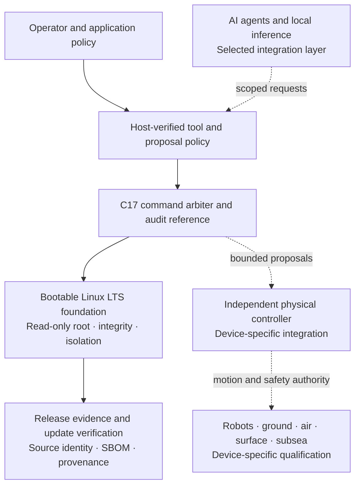

<div align="center">

# NeuraOS

### Intelligence at the edge. Authority by design.

**Build intelligent machines on a governed edge foundation.**

**PUBLIC EDITION · SEPTEMBER 2026 · PRODUCT & ARCHITECTURE**

[](#public-edition)
[](#platform)
[](#post-quantum-security)
[](#engineering-evidence)

[**Discuss your platform →**](mailto:info@neuraparse.com?subject=NeuraOS%20Platform%20Discussion) · [Capabilities](#platform) · [Applications](#applications) · [Security & PQC](#security-and-trust) · [2026 and beyond](#2026-and-beyond) · [Evidence](#engineering-evidence)


<sub>AI-generated concept artwork · A multi-domain platform vision, not deployed-hardware evidence.</sub>

**LOCAL INTELLIGENCE &nbsp; / &nbsp; GOVERNED ACTION &nbsp; / &nbsp; VERIFIABLE CHANGE**

</div>

NeuraOS is an **operating-system foundation for physical AI**: intelligence that observes, reasons and assists where machines meet the real world. It brings a bootable Linux platform, governed agent policies, custom-device integration contracts and release evidence into one edge architecture.

For robotics OEMs, embedded-system teams and integrators, the ambition is clear: **keep intelligence close to the machine, keep authority explicit, and make every change reviewable.** From an inspection robot to a custom airborne or subsea platform, NeuraOS provides a common integration method while preserving each device's constraints.

**One foundation. Many machine classes. Qualification for each.** Explore the [platform capabilities](#platform), [integration path](#an-integration-path-teams-can-review) and [forward direction](#2026-and-beyond).

> **Public Edition** presents the product architecture and current engineering baseline. The `1.0.0-rc.8` reference has been exercised on hosts and QEMU; physical deployment qualification remains open. [View the verified scope](#engineering-evidence).

## Why NeuraOS

The hard part of an intelligent machine is the complete system: models, hardware, operators, communications and updates must work within the same rules. NeuraOS makes **identity, authority and evidence** shared architectural concerns, from the edge image to the deployment review.

| What your team needs | How NeuraOS approaches it | Intended engineering value |
|---|---|---|
| Keep intelligence close to the machine | Local-first inference architecture, explicit resource budgets and board-specific runtime selection | Control where computation and sensitive data belong |
| Give AI useful but bounded authority | Typed proposals, tool permissions, freshness checks, approval rules and an independent command arbiter | Make agent permissions testable and reviewable |
| Build across different device families | Exact hardware/BSP manifests, peripheral ownership and ordered bring-up stages | Reuse an integration method while preserving each device’s constraints |
| Evolve software with traceability | Immutable inputs, signed-update workflows, SBOMs, provenance and rollback contracts | Connect each proposed release to its source and verification record |
| Prepare for disrupted conditions | Fault injection, deterministic replay and declared minimum-risk behaviour | Explore failure handling before hardware and field evaluation |
| Plan for a longer security lifecycle | Maintained LTS foundations, hybrid PQC profiles and explicit migration boundaries | Make cryptographic and platform upgrades part of the architecture |

The value proposition is integration continuity: a device manifest informs bring-up; bounded interfaces inform testing; test evidence informs the release decision. These are design objectives, with delivered reference implementations and integration work identified below.

## Platform

### A purpose-built edge foundation

The current reference boots a minimal Linux operating system built with Buildroot LTS. A read-only root, dm-verity integrity checking, locked accounts, binary hardening and host firewall provide a concrete foundation for embedded integration. The C17 command arbiter and hash-linked audit reference run both on the host and inside the QEMU image.

Images are assembled around a device profile and its required components. The architecture accommodates different compute and accelerator choices through explicit board, firmware and runtime boundaries.

### Governed AI agents

**Useful intelligence, bounded responsibility.** The intended workloads include local perception, inspection analysis, maintenance assistance and scoped agent tools. Model and accelerator choices belong to the device profile; selecting a runtime does not grant it physical-control authority.

NeuraOS gives agent integration an explicit execution model: identify the caller, verify the tool and artifact, evaluate permissions, obtain required approval, and apply isolation before execution. The host policy evaluator rejects stale requests, replay, privilege expansion and unauthorized capabilities.

MCP and A2A define the selected interoperability boundary; WasmEdge defines the selected portable-tool runtime. Their target integration remains planned. Installed bubblewrap isolation primitives are exercised at boot, while the deterministic arbiter preserves a separate control boundary.

### A common integration model for machines

The mobility catalogue defines **11 platform classes** spanning industrial robots, AMRs, civil road and off-road vehicles, UAS, surface vessels and underwater vehicles, with separate non-weapon defence profiles. **17 protocol contracts** and ordered conformance checks describe how an adapter joins that architecture.

The implemented host gateway policy validates identity, freshness, sequence, reference frame, units, approval and limits on high-level proposals. Device adapters and physical controllers must be qualified for each specific integration.

### Custom hardware with an explicit path to bring-up

The device workflow records the exact module, carrier, storage, firmware, BSP, sensor and peripheral set. **12 ordered bring-up stages** track boot/recovery, provisioning, interfaces, calibration, timing, thermal behaviour and review evidence. Intake tooling creates an integration scaffold and checks the order and integrity of recorded evidence.

The research catalogue covers **12 vendor and integration-provider routes**. Evaluated compute options include NVIDIA Jetson AGX Orin Industrial, NXP i.MX 95 Industrial and AMD Kria K26 Industrial, with Qualcomm Dragonwing IQ-9075, Intel Core Ultra Series 3 for Edge and Hailo-10H also evaluated. All six options await qualification against an exact NeuraOS board/BSP configuration.

### Digital rehearsal across domains

The reference simulation campaign executes **1,100 deterministic runs across 22 scenarios**. It exercises sensor and actuator faults, network loss, replay, clock changes, compute overruns, power loss, obstacles and operational-boundary violations across the declared platform classes.

Eight backend contracts define the next integration layer, including Gazebo, PX4/ArduPilot SITL, CARLA, Webots, VRX and Stonefish. External SIL/HIL evidence binds the simulator, world, vehicle, sensors, parameters and results to exact artifacts. The installed reference campaign is logical simulation; high-fidelity physics and hardware testing are separate integration work.

## Applications

NeuraOS is designed as a foundation for the following integration programs. Each target application has its own hardware, performance and operating requirements to establish during qualification.

| Environment | Example integration objectives | Platform emphasis |
|---|---|---|
| Manufacturing and warehouses | Inspection, AMR coordination, workcell assistance and machine supervision | Bounded agent permissions, device identity and repeatable fault handling |
| Energy and critical infrastructure | Remote inspection, local anomaly analysis and maintenance assistance | Local data boundaries, disrupted-link planning and traceable updates |
| Agriculture, construction and mining | Worksite monitoring, equipment assistance and off-road autonomy research | Custom hardware profiles, operational limits and recovery planning |
| Ground mobility | Civil vehicle integration, fleet telemetry and assisted operations | Explicit protocol boundaries and independent motion authority |
| Air systems | Inspection UAS, mapping and search-and-rescue integration | Companion-compute boundaries, link-loss policy and flight-controller separation |
| Surface and subsea systems | Port inspection, offshore monitoring and underwater robotics | Domain-specific interfaces, energy constraints and recovery evidence |
| Public-service and defence support | Logistics, engineering, inspection, emergency response and operator assistance | Human authority, access control and auditable task boundaries |

Defence scope is limited to **non-weapon systems**. Weapon control, target engagement, lethal-force authority and bypassing independent safety protections are excluded from the platform contracts.

## Architecture

The design keeps application intelligence, agent permissions, operating-system services and physical safety authority distinct. Solid connections below describe the reference software; dashed connections identify integration boundaries.



Models can propose actions inside their assigned scope. Operator authority, command validation and independent stop/safe-state mechanisms govern whether a physical action may occur. The architecture keeps primary flight, motion and emergency-control loops outside the AI workload.

## Security and trust

**Establish identity. Bound execution. Verify the change. Preserve the evidence.** NeuraOS treats security as a lifecycle across the operating system, agent boundary and release process.

<p align="center">
  
  <br>
  <sub>AI-generated concept artwork · Runtime boundaries, hybrid cryptography and release traceability.</sub>
</p>

- **Platform integrity.** QEMU tests cover a dm-verity-protected root and rejection of a modified data block, plus test-key OVMF Secure Boot and TPM measurements.
- **Process isolation.** The image includes namespace, privilege, filesystem, device and network isolation checks, with kernel controls and an audit of target ELF hardening.
- **Controlled updates.** RAUC verifies a test-signed bundle and rejects a wrong key or modified payload. A/B state-machine tests cover inactive slots, retries, confirmation and rollback policy.
- **Traceable releases.** CycloneDX inventory, SLSA provenance, legal inventory and a deterministic archive bind the rc.8 build to 217 exact private-source inputs.
- **Bounded agent authority.** Caller identity, tool identity, approval, freshness and resource permissions are evaluated independently of model-generated instructions.
- **Security maintenance.** A pinned vulnerability scanner and reproducible reconciliation preserve findings for product-security review, VEX and risk-owner disposition.

Physical protected keys, attestation, A/B storage and production signing belong to the target qualification program. Current release status is recorded in [engineering evidence](#engineering-evidence).

## Post-quantum security

**Plan for the lifetime of the machine—and the data it protects.** NeuraOS includes tested building blocks for a transition to quantum-resistant communications and signatures. Its installed **OpenSSL 3.5.8 LTS** supplies native ML-KEM, ML-DSA and SLH-DSA implementations, based on the finalized [NIST FIPS 203](https://csrc.nist.gov/pubs/fips/203/final), [FIPS 204](https://csrc.nist.gov/pubs/fips/204/final) and [FIPS 205](https://csrc.nist.gov/pubs/fips/205/final) standards.

| Profile or capability | Cryptography | Verified scope |
|---|---|---|
| Balanced hybrid TLS | `X25519MLKEM768` + TLS 1.3 + AES-256-GCM | Opt-in profile; mutually authenticated loopback connection and rejection tests |
| High-assurance hybrid TLS | `SecP384r1MLKEM1024` + TLS 1.3 + AES-256-GCM | Opt-in profile; same connection checks with the larger ML-KEM parameter set |
| Post-quantum signatures | `ML-DSA-65` and `ML-DSA-87` | Detached signing, verification and tamper/wrong-key/wrong-context rejection |
| Hash-based signature diversity | `SLH-DSA-SHA2-256s` | Detached signature tests for evaluation of infrequent signing and recovery use cases |

**39 checks passed** using the built target OpenSSL executable and libraries on an x86-64 Linux host. The two TLS profiles require their named hybrid group and reject classical-only negotiation, TLS 1.2, AES-128-only negotiation, wrong hostnames and invalid or missing peer credentials. Hybrid key establishment follows [RFC 10024](https://www.rfc-editor.org/rfc/rfc10024.html).

Service adoption is explicit. These supplementary profiles were added after the rc.8 image build; they do not globally reconfigure services or replace boot/update signatures. TLS authentication in the tests uses ECDSA P-384 certificates. PQ authentication, production signer integration and device performance qualification remain separate work.

<details>
<summary><strong>PQC design choices and migration requirements</strong></summary>

- OpenSSL 3.5 is the maintained LTS choice, with upstream support through 8 April 2030; newer 3.6 and 4.0 branches are tracked separately. See the [official support table](https://openssl-library.org/source/).
- The profiles are `config/pqc-balanced.cnf` and `config/pqc-high-assurance.cnf` in the controlled workspace. Load the selected file with the service’s `OPENSSL_CONF`, retain its TLS/group/cipher restrictions and configure mutual authentication, peer authorization, rotation and revocation in the service.
- Keep 0-RTT disabled for commands and updates. PQC-required endpoints must not silently retry through a classical-only connection.
- Inventory key purposes, provider versions, certificate chains, peer capabilities and data lifetimes. Qualify entropy sources, protected key storage, packet sizes, reconnect costs, CPU/RAM and latency on each target.
- Future dual-signature artifact policies must verify both selected signatures against the same exact payload, purpose and version. The current primitive tests do not implement that production verifier migration.
- ML-DSA authentication for TLS is tracked through [draft-ietf-tls-mldsa-05](https://datatracker.ietf.org/doc/draft-ietf-tls-mldsa/); the specification was still a draft at the 5 September 2026 review.
- QKD requires dedicated optical infrastructure and an authenticated classical channel. No QKD equipment is integrated; see the [NSA guidance](https://www.nsa.gov/Cybersecurity/Post-Quantum-Cybersecurity-Resources/). [HQC remains a NIST standardization selection](https://csrc.nist.gov/Projects/post-quantum-cryptography/post-quantum-cryptography-standardization/selected-algorithms), not an enabled fallback.
- These tests establish implementation capability, not FIPS 140-3 module validation, CNSA approval, independent interoperability, side-channel assurance or physical-device qualification.

</details>

## 2026 and beyond

**A platform direction for the next generation of intelligent machines.** The September 2026 review connects NeuraOS's architecture to concrete changes in the ecosystem:

- **Hybrid PQC has an interoperable standards foundation.** Published in August 2026, RFC 10024 specifies the hybrid TLS groups used by the two NeuraOS test profiles. Our next adoption boundary is service integration and measured device performance. [IETF standard](https://www.rfc-editor.org/info/rfc10024/).
- **Agent interoperability is becoming more explicit.** MCP's 2026-07-28 specification defines stateless, self-contained requests and per-request capability negotiation. NeuraOS selects MCP for tool/context interoperability and A2A for peer-agent tasks, with policy enforcement and target adapters still to integrate. [MCP specification](https://modelcontextprotocol.io/specification/2026-07-28), [A2A specification](https://a2a-protocol.org/latest/specification/).
- **Security operations belong in product planning.** For products in scope, EU Cyber Resilience Act reporting obligations apply from **11 September 2026**, ahead of full application on **11 December 2027**. This makes vulnerability handling, traceability and support responsibilities timely integration questions; it does not establish NeuraOS compliance. [European Commission overview](https://digital-strategy.ec.europa.eu/en/policies/cra-summary).

**Maintained foundations, deliberate adoption.** Buildroot 2026.08 became the current stable release on 4 September; the reference retains the 2025.02 LTS line, supported upstream through March 2028. OpenSSL 3.5 LTS has an upstream support horizon of 8 April 2030. These are component lifecycles, not a NeuraOS support or security guarantee. [Buildroot releases](https://buildroot.org/download.html), [OpenSSL support table](https://openssl-library.org/source/).

### Forward direction

The following priorities describe the product direction. They are **planned integration and qualification work**, not shipped capabilities or committed delivery dates.

| Priority | Next capability to establish | Evidence required before a delivery claim |
|---|---|---|
| Physical AI at the edge | Board-specific perception, local inference and bounded agent workloads | Exact model/runtime identity; accuracy, latency, memory, power and thermal measurements |
| Governed agent interoperability | MCP/A2A adapters, portable tools and target-enforced permissions | End-to-end identity, approval, isolation, denial and recovery tests on the device |
| Multi-domain device programs | Qualified BSPs, vehicle adapters and high-fidelity simulation backends | Bring-up records, protocol conformance, SIL/HIL and independent control-path review |
| Cryptographic agility | Service-level hybrid TLS adoption and a reviewed PQ artifact-authentication policy | Interoperability, protected-key lifecycle, downgrade rejection and target performance evidence |
| Fleet and product lifecycle | Production signing, physical A/B recovery and reviewed update-metadata integration | Key ceremonies, independent reconstruction, rollback tests and security disposition |

The ambition is broad; the delivery unit is precise: **one versioned device profile, one defined operating envelope, one reviewable evidence set.**

## An integration path teams can review

Each program starts with one defined system and an explicit success criterion. The workflow connects hardware selection to the evidence needed for a deployment decision.

Start the discussion with the outcome your team needs:

- **A custom edge platform:** scope a board-specific OS profile, device provisioning and a bring-up evidence package.
- **Governed intelligence on a machine:** scope model/runtime selection, agent permissions and bounded tool or controller interfaces.
- **A defensible evaluation program:** scope simulation, target measurements, security review and the evidence required for a pilot decision.

These are engagement scopes to agree, not off-the-shelf qualified products or promised delivery terms.

| Step | Engineering focus | Reviewable output |
|---|---|---|
| 1. Define the system | Intended use, exact hardware, operating environment, data boundary and authority | Agreed integration scope and device manifest |
| 2. Establish the platform | BSP, firmware, boot/recovery, provisioning, peripherals and compute budget | Versioned platform profile and bring-up evidence |
| 3. Integrate intelligence | Selected models/runtimes, agent tools, transport adapters and independent controller | Bounded interfaces and conformance results |
| 4. Rehearse the system | Simulation, SIL/HIL, faults, timing, thermal behaviour and recovery | Evidence for the specific system and its failure modes |
| 5. Review deployment | Security disposition, signing, operational limits, crew, site and applicable approvals | Scoped production/field decision by the responsible parties |

The applicability catalogue provides a starting point across **15 review dimensions, 39 official-source instruments, 18 use cases and eight jurisdiction profiles**. It supports engineering assessment; local legal, regulatory and operating approvals depend on the deployment.

**Planning an OEM platform or a custom device?** [Discuss the target system with NeuraParse](mailto:info@neuraparse.com?subject=NeuraOS%20Integration%20Discussion). Share a non-sensitive summary of the machine, compute platform, intended environment and integration objective.

## Engineering evidence

The current **1.0.0-rc.8 reference**, reviewed on **5 September 2026**, is a bootable x86-64 QEMU platform with host-verified policy and simulation tooling. Subsequent PQC work is recorded as supplementary host evidence.

| Recorded result | Scope |
|---|---|
| **1,100 / 1,100** simulation runs passed | 22 deterministic reference scenarios across the declared platform classes |
| **1,000,000** sequential cycles passed | C17 command arbiter and hash-linked audit endurance |
| **144** Python tests passed | Policy, schema, source/evidence and rejection workflows |
| **39 / 39** PQC checks passed | Cryptographic primitives and two strict hybrid TLS profiles |
| **205** target ELF objects audited | Applicable PIE, non-executable stack, RELRO and binding requirements |
| **5** image artifacts matched | Consecutive same-output build comparison |

**Deployment status:** 7 of 17 production gates are satisfied. Nine field-readiness blockers remain open, and physical operation is **NO-GO**. The candidate remains `production_authorized: false`. Security disposition, production signatures, independent reconstruction, target integration and physical qualification are required before release approval.

<details>
<summary><strong>Complete verification record and retained evidence</strong></summary>

| Area | Delivered and checked | Evidence boundary |
|---|---|---|
| Core software | 144 Python tests, C arbiter/audit tests, compiler analysis, Flake8, ShellCheck and ASan/UBSan passed | Host verification; target timing and independent safety review remain open |
| Contracts and documentation | 59 JSON schemas, 34 configuration instances and 51 Markdown documents checked | Structural validation and policy tests, not hardware qualification |
| Operating-system image | Clean rc.8 build; 19 explicit packages, 40 SBOM components, 57 kernel controls and 514 target commands verified | x86-64 QEMU reference profile |
| Binary hardening | 205 ELF objects checked for applicable PIE, NX stack, RELRO and immediate-binding requirements | Two named GCC runtime BIND_NOW exceptions; first-party stack-canary evidence required |
| Root integrity and boot | dm-verity boot passed; corrupted BusyBox block rejected; test-key Secure Boot and TPM measurements captured | QEMU, OVMF and swtpm; physical attestation pending |
| Updates and isolation | RAUC correct-key verification, wrong-key/tamper rejection, A/B state-machine tests and boot-time bubblewrap isolation checks | Physical flash/rollback and full agent-runtime enforcement pending |
| Repeatability and endurance | Five image hashes matched across same-output builds; 1,000,000 arbiter/audit cycles passed | Independent builder reproduction and physical endurance pending |
| Private source and supply chain | 217 exact rc.8 source inputs archived; CycloneDX inventory, SLSA provenance, legal inventory and vulnerability reconciliation generated | Source review, production signing and reviewed VEX pending |
| Devices and mobility | 12 researched support routes, 12 ordered bring-up stages, 11 platform classes and 17 protocol contracts validated | Six compute options evaluated; no physical target or vehicle adapter qualified |
| Simulation | 1,100/1,100 runs passed across 22 scenarios; eight backend contracts defined | Logical reference simulation; high-fidelity SIL/HIL backends require integration |
| Deployment applicability | 15 dimensions, 39 official-source instruments, 18 use cases and eight jurisdiction profiles checked | Deployment-specific legal and operational decisions remain external |
| Post-quantum cryptography | 39/39 checks passed for ML-KEM, ML-DSA, SLH-DSA and two strict hybrid TLS profiles | Target OpenSSL executed on a Linux host; supplementary work after the rc.8 image build |

These results come from distinct engineering suites and do not constitute certification. Local records are retained under
`build/platform/output/evidence/`, `build/platform/output/release/`,
`build/release-source-evidence-rc8-final/` and
`build/pqc-selftest-20260905-final.json`. Public Git publishes this account of
the results; it does not distribute the private evidence bundles.

The image includes 19 explicit packages resolving to 40 SBOM components. QEMU tests cover positive/negative dm-verity boot, test-key Secure Boot, TPM PCR 0/2/4/7/10 and event-log capture. RAUC 1.15.2 verifies a valid test bundle and rejects wrong-key and payload-tamper cases. Two narrowly named GCC runtime libraries are exceptions to immediate binding; first-party stack-canary evidence is required.

The source archive and candidate evidence refer to the exact rc.8 build. A same-output hash comparison is distinct from reconstruction by an independent builder. The PQC report identifies its tested binaries, profiles and runner by SHA-256 and retains no private test keys or shared secrets.

</details>

<details>
<summary><strong>Security disposition and physical qualification requirements</strong></summary>

The recorded Grype 0.116.1 scan contains **189 matches**, including 7 critical and 59 high. Reconciliation identifies **7 Buildroot backport candidates** and **182 unresolved matches**, including 7 critical and 58 high. Neither group is automatically accepted: independent product-security review, signed VEX and risk-owner disposition remain production requirements.

The nine open field requirements cover the exact physical target, vehicle integration, independent safety path, operational envelope, SIL/HIL qualification, field operations, legal/insurance review, jurisdiction applicability and product-security triage. No physical compute option, vehicle adapter or high-fidelity backend is currently qualified.

Production verification requires immutable source identity, verified release/update signature bundles and fresh role-separated claims bound to the exact evidence. Field verification additionally binds the physical system, trial plan, site, crew, validity window and applicable approvals. Example policies and planning documents cannot authorize a deployment.

The reference C core is not a certified vehicle controller. AI agent, robotics transport and inference integrations require the implementation and target evidence listed in the technology baseline. Standards references describe design inputs, not certification or blanket legal compliance.

</details>

## Technology ecosystem

NeuraOS separates the installed platform foundation from the runtimes and interfaces selected for integration. This lets a device program choose the compute, robotics and inference stack appropriate to its constraints.

**Reference foundation:** Linux LTS built with Buildroot LTS, plus installed OpenSSL, RAUC, bubblewrap and the deterministic NeuraOS core.

**Selected integration ecosystem:** ROS 2, DDS, Zenoh, MAVLink, PX4/ArduPilot, ONNX Runtime, LiteRT, ExecuTorch, OpenVINO, OpenCV, ncnn, llama.cpp, WasmEdge, MCP and A2A.

<details>
<summary><strong>Verified technology baseline, versions and adoption state</strong></summary>

Technology selections were checked against official upstream sources on **5 September 2026**. The adoption column distinguishes installed components from selected interfaces and planned adapters. The controlled workspace records the baseline in `config/technology-baseline.json`.

| Layer | Verified release | Purpose | Adoption |
|---|---|---|---|
| Kernel | [Linux 6.18 LTS](https://www.kernel.org/releases.html) + PREEMPT_RT; QEMU profile pin 6.18.49 | Long-lived real-time-capable platform | Active production-candidate profile |
| Embedded build | [Buildroot 2025.02.17 LTS](https://buildroot.org/download.html) · 2026.08 current stable | Reproducible, board-specific images | Active LTS profile; stable line evaluated only |
| Post-quantum cryptography | [OpenSSL 3.5.8 LTS](https://openssl-library.org/source/) · NIST FIPS 203/204/205 · [RFC 10024](https://www.rfc-editor.org/rfc/rfc10024.html) | ML-KEM hybrid TLS, ML-DSA and SLH-DSA primitives | Installed primitives exercised; two opt-in TLS profiles tested on host; service adoption pending |
| Robotics | [ROS 2 Lyrical Luth](https://docs.ros.org/en/lyrical/) LTS through May 2031 | Lifecycle, execution and ecosystem APIs | Planned adapter |
| Real-time data | [Fast DDS 3.6.2](https://github.com/eProsima/Fast-DDS/releases/tag/v3.6.2) + DDS Security | Authenticated QoS and shared-memory pub/sub | Planned adapter |
| Edge fabric | [Eclipse Zenoh 1.10.0](https://github.com/eclipse-zenoh/zenoh/releases/tag/1.10.0) | Local-first pub/sub, query and disrupted-link operation | Planned adapter |
| Vehicle API | MAVLink 2 signing + [MAVSDK 3.17.4](https://github.com/mavlink/MAVSDK/releases/tag/v3.17.4) | Authenticated vehicle telemetry and commands | Planned adapter |
| Autopilot adapters | [PX4 1.17.0](https://github.com/PX4/PX4-Autopilot/releases/tag/v1.17.0) · [ArduPilot 4.7.1](https://github.com/ArduPilot/ardupilot/releases/tag/Copter-4.7.1) | Companion integration; never primary safety authority | Planned adapter |
| Simulation and scenarios | Gazebo Jetty · CARLA 0.10.0 · Webots R2025a · VRX 3.1.0 · Stonefish 1.6.0 · ASAM OpenSCENARIO DSL 2.2.0/XML 1.4.0 | Deterministic regression plus exact-backend SIL/HIL contracts | Reference runner active; high-fidelity backends contract-only |
| Portable inference | [ONNX Runtime 1.29.0](https://github.com/microsoft/onnxruntime/releases/tag/v1.29.0) | Cross-platform execution-provider boundary | Planned adapter |
| On-device ML | [LiteRT 2.2.0](https://github.com/google-ai-edge/LiteRT/releases/tag/v2.2.0) · [ExecuTorch 1.4.1](https://github.com/pytorch/executorch/releases/tag/v1.4.1) | AOT compilation, quantization and device delegates | Planned adapter |
| Intel inference | [OpenVINO 2026.3.1](https://github.com/openvinotoolkit/openvino/releases/tag/2026.3.1) | CPU, integrated GPU and NPU inference | Planned adapter |
| Vision | [OpenCV 5.0.0](https://github.com/opencv/opencv/releases/tag/5.0.0) · [ncnn 20260526](https://github.com/Tencent/ncnn/releases/tag/20260526) | C++17 vision and compact native inference | Planned adapter |
| Local generative AI | [llama.cpp 0.4.0](https://github.com/ggml-org/llama.cpp/releases/tag/v0.4.0) | Offline, resource-bounded language assistance | Planned adapter |
| Sandboxed extensions | [WasmEdge 0.17.1](https://github.com/WasmEdge/WasmEdge/releases/tag/0.17.1) + [bubblewrap 0.11.2](https://github.com/containers/bubblewrap/releases/tag/v0.11.2) | Portable tool runtime plus boot-tested process isolation | Wasm runtime planned; launcher installed |
| NVIDIA edge stack | [JetPack 7.2.1](https://developer.nvidia.com/embedded/jetpack-archive) | Vendor BSP/CUDA stack for evaluated Jetson profiles | Planned board-specific adapter |
| Agent tool/context protocol | [MCP 2026-07-28](https://modelcontextprotocol.io/specification/2026-07-28) | Normalized tool and context interoperability behind the broker | Selected contract; not integrated |
| Agent-to-agent protocol | [A2A 1.0.0](https://a2a-protocol.org/latest/specification/) | Authenticated peer-agent task interoperability | Selected contract; not integrated |
| Target update installer | [RAUC 1.15.2](https://rauc.readthedocs.io/en/latest/changes.html) | Signed bundle verification and inactive-slot installation | CLI installed; physical slots pending |
| Update metadata | [TUF 1.0.36](https://theupdateframework.github.io/specification/latest/) · [Uptane 2.1.0](https://uptane.org/docs/latest/all-versions) | Repository-compromise resistance and multi-controller vehicle/fleet profiles | Selected contract; not integrated |
| Observability | [OpenTelemetry 1.60.0](https://opentelemetry.io/docs/specs/otel/) | Portable traces/metrics/log correlation around local evidence | Selected contract; export disabled by default |
| Artifact signing | [Sigstore Cosign 3.1.3](https://github.com/sigstore/cosign/releases/tag/v3.1.3) | Signature bundles and transparency evidence | Release control |
| Vulnerability scanning | [Grype 0.116.1](https://github.com/anchore/grype/releases/tag/v0.116.1) | SBOM scanning with database provenance and retained raw findings | Active release control; disposition pending |
| Supply-chain evidence | [SLSA 1.2](https://slsa.dev/spec/v1.2/) · [SPDX 3.0.1](https://spdx.github.io/spdx-spec/v3.0.1/) · [CycloneDX 1.7](https://cyclonedx.org/specification/overview/) | Provenance, SBOM, VEX and inventory | Release control |

A board profile includes only the runtimes selected and qualified for its use case. The controlled workspace retains the package catalogue, primary-source hashes and architecture decisions.

</details>

<details>
<summary><strong>Delivery history: foundation through rc.8 and PQC</strong></summary>

| Milestone | Delivered scope |
|---|---|
| 0.1–0.2 foundation | Product and technology contracts, deterministic C core, hash-locked Buildroot/Linux image and hardened read-only runtime |
| rc.1 | dm-verity positive/negative boots, reproducible artifacts, SBOM/provenance/legal inventory and A/B update policy |
| rc.2–rc.3 | Device research, governed agent contracts, RAUC and bubblewrap installation, QEMU Secure Boot/TPM, vulnerability scanning and signed-evidence promotion workflows |
| rc.4–rc.5 | Custom-device onboarding, peripheral ownership, staged bring-up, civil/non-weapon mobility classes and bounded gateway/conformance tooling |
| rc.6–rc.7 | Multi-domain simulation campaign, external SIL/HIL evidence contracts, global applicability assessment and deployment-specific field authorization checks |
| rc.8 | Security package refresh, unused `jq` removal, vulnerability reconciliation, complete private-source identity, stale-build invalidation and all-target ELF hardening |
| After the rc.8 image build | Two opt-in PQC TLS profiles, ML-KEM/ML-DSA/SLH-DSA capability tests and the consolidated public README; no new firmware version or production authorization |

</details>

## Public Edition

Public Edition is NeuraOS’s **public product and architecture brief**. It gives engineering leaders, OEMs and prospective integration partners a view of the platform direction, implemented reference controls, evaluated technologies and available test results.

This Git repository intentionally contains only `README.md`. Implementation, firmware, models, configuration, detailed documentation and raw evidence remain in the controlled workspace. The edition label identifies this overview; the demonstrated system has the maturity documented in the engineering evidence above.

The original AI-generated illustrations are hosted as [Public Edition media assets](https://github.com/neuraparse/neuraos/releases/tag/public-media-2026-09-v1), outside the Git source tree. They communicate architectural concepts, not shipping hardware, customer deployments or measured security properties. The media publication is not a firmware release.

Commercial discussions can cover a defined device program, integration requirements, evaluation scope, licensing and the evidence required for delivery. Availability, deliverables and support terms are established by agreement.

<details>
<summary><strong>For collaborators with access to the controlled workspace</strong></summary>

Local documentation includes tutorials, build/onboarding procedures, architecture and API references, assurance records and design decisions. The main paths are `docs/README.md`, `docs/ROADMAP.md`, `docs/assurance/`, `config/`, `schemas/` and `tools/`.

On the supported Linux host, the documented verification workflow is:

```bash
make check
make sanitize
make release-candidate
python3 tools/pqc_selftest.py --report build/pqc-selftest.json
```

The PQC check is supplementary and requires a new filename for each retained report. `make production-check` and `make field-trial-check` validate external authorization evidence; the current example policies are intentionally rejected. These commands require the full controlled workspace.

</details>

## Work with NeuraParse

**Bring the machine. Define the boundaries. Build the evidence.** Start the conversation with the target hardware, intended workloads, connectivity constraints and the outcome your team needs. A useful first discussion identifies the integration scope, success criteria, qualification responsibilities and expected deliverables.

[**Start a platform conversation →**](mailto:info@neuraparse.com?subject=NeuraOS%20Platform%20Discussion) · [Website](https://neuraparse.com) · [Product questions](https://github.com/neuraparse/neuraos/issues)

For suspected vulnerabilities, use [private vulnerability reporting](https://github.com/neuraparse/neuraos/security/advisories/new) when available. Otherwise send a minimal, non-sensitive request for a secure channel to [info@neuraparse.com](mailto:info@neuraparse.com). Keep credentials, customer environments, operational logs and restricted information out of public issues.

## Licence

Copyright © 2024–2026 NeuraParse. **All rights reserved.** NeuraOS-specific materials are proprietary. Use, modification, distribution and licensing rights require a separate written agreement with NeuraParse.

Third-party technologies remain subject to their own licences and terms. References to projects, vendors and standards do not imply redistribution, partnership, endorsement or certification.

---

<div align="center">

**NeuraOS · Local intelligence. Governed action. Verifiable systems.**

[Discuss your platform](mailto:info@neuraparse.com?subject=NeuraOS%20Platform%20Discussion) · [Public repository](https://github.com/neuraparse/neuraos)

</div>
