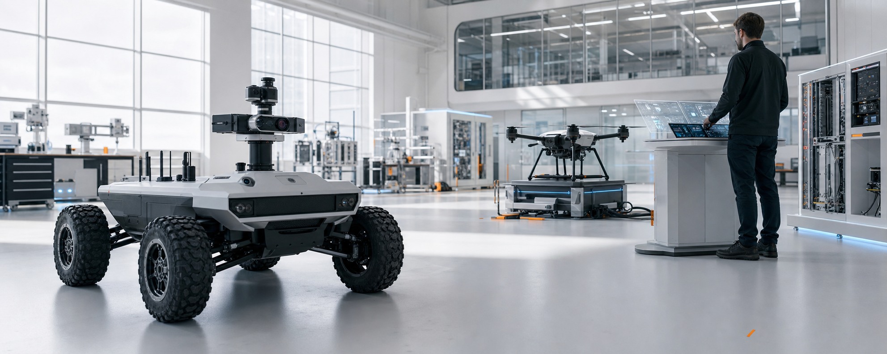
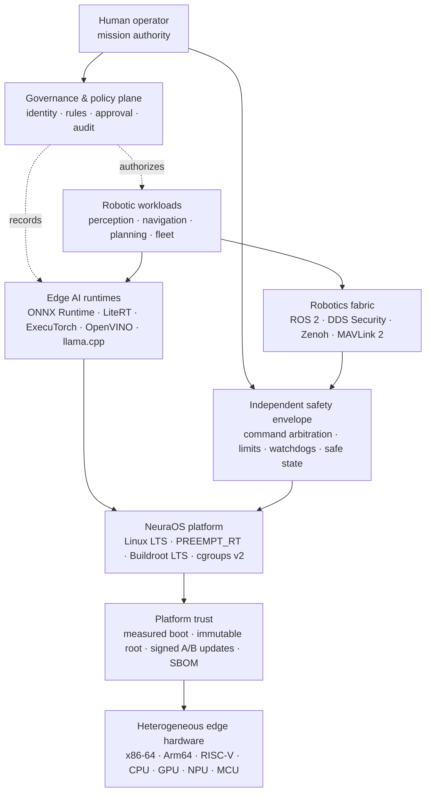
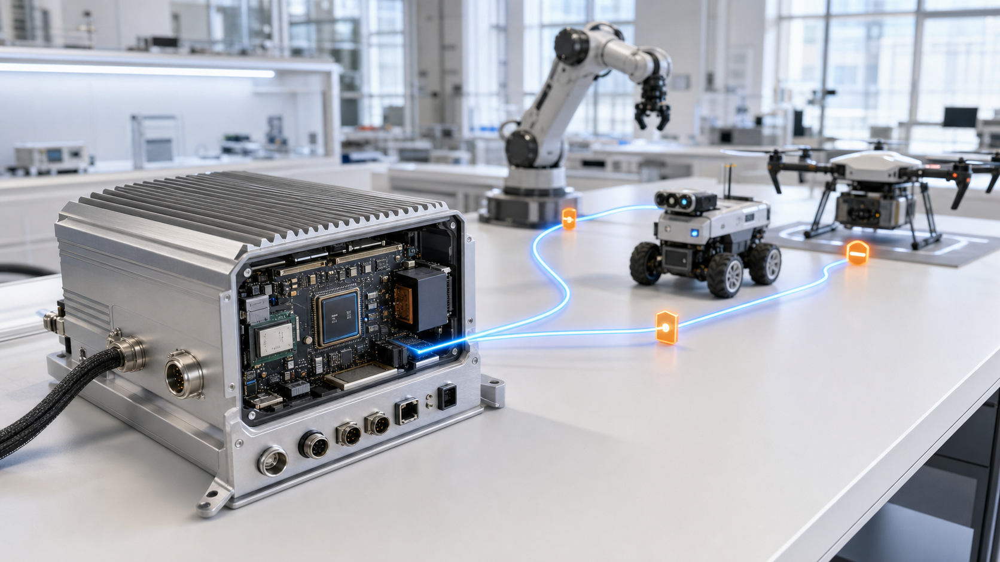

# NeuraOS

### Governed Edge Intelligence for Robotics & Defence Systems

**Deterministic control. Local AI. Human authority. Evidence by design.**

[Product](#product) · [Architecture](#system-architecture) · [Technology](#current-technology-stack) · [Governance](#governed-autonomy) · [Safety](#safety-envelope) · [Security](#security-baseline)

  
   
  Human-supervised edge intelligence across a heterogeneous robotic estate.

## Product

NeuraOS is an edge operating platform for perception, sensor fusion, autonomous planning and local inference close to robotic hardware—especially where connectivity is intermittent, latency is bounded and every consequential action requires explicit governance.

The product is built around five operating principles:

- **Edge sovereignty** — mission data and inference can remain on the device or inside a controlled network boundary.
- **Bounded autonomy** — policy, time, geography, confidence and resource limits are enforced outside the model.
- **Deterministic safety** — probabilistic AI never replaces the independent safety path, command arbiter or emergency stop.
- **Evidence-first engineering** — every model, configuration, update and decision is attributable, reviewable and reversible.
- **Open interoperability** — robotics, autonomy and inference interfaces use maintained ecosystem standards instead of proprietary lock-in.

### Core capabilities

| Domain | Product capability | Built-in control |
|---|---|---|
| Robotic perception | Multi-sensor detection, tracking and scene understanding | Confidence calibration, stale-data rejection and operator-visible uncertainty |
| Ground, air and maritime robotics | Navigation, route planning and vehicle integration | Independent flight/motion controller, geofence and minimum-risk state |
| Multi-vehicle operations | Telemetry, task allocation and resilient coordination | Authenticated membership, rate limits and loss-of-link policy |
| Disconnected edge AI | Local vision, speech and language inference | Approved models only; no silent online learning |
| Simulation and digital twins | SIL/HIL validation, deterministic replay and fault injection | Reproducible evidence, rollback proof and hazard traceability |

## System architecture

The governance plane grants authority and produces evidence; it is not a data-plane dependency for every real-time cycle. The safety envelope remains deterministic and able to reject, pause or override AI-originated commands.

  
   
  A signed workload path from rugged edge compute to a mixed robotic estate.

## Current technology stack

NeuraOS combines maintained LTS foundations with current stable robotics, inference and security runtimes. Release builds use immutable source revisions, cryptographic hashes, machine-readable SBOMs and signed provenance. Every version pin below was verified against its official upstream release channel on **27 August 2026**.

| Layer | Current release | Role |
|---|---|---|
| Kernel | [Linux 6.18 LTS](https://www.kernel.org/releases.html) + PREEMPT_RT | Long-lived, real-time-capable platform baseline |
| Embedded build | [Buildroot 2025.02.17 LTS](https://buildroot.org/download.html) · [2026.05.2](https://buildroot.org/download.html) Stable | Minimal, reproducible and board-specific Linux images |
| Robotics | [ROS 2 Lyrical Luth](https://docs.ros.org/en/lyrical/) LTS through May 2031 | Lifecycle nodes, asynchronous executors, zero-copy buffer paths and ecosystem interoperability |
| Real-time data | [Fast DDS 3.6.2](https://github.com/eProsima/Fast-DDS/releases/tag/v3.6.2) + DDS Security | Authenticated QoS, shared-memory transport and policy-controlled pub/sub |
| Edge fabric | [Eclipse Zenoh 1.10.0](https://github.com/eclipse-zenoh/zenoh/releases/tag/1.10.0) | Shared memory, `io_uring`, store/query/pub-sub and disrupted-link operation |
| Vehicle APIs | MAVLink 2 signing + [MAVSDK 3.17.3](https://github.com/mavlink/MAVSDK/releases/tag/v3.17.3) | Authenticated, versioned vehicle telemetry and command integration |
| Autopilot adapters | [PX4 1.17.0](https://github.com/PX4/PX4-Autopilot/releases/tag/v1.17.0) · [ArduPilot Copter 4.7.0](https://github.com/ArduPilot/ardupilot/releases/tag/Copter-4.7.0) | Companion-computer integration with independent safety authority |
| Portable inference | [ONNX Runtime 1.29.0](https://github.com/microsoft/onnxruntime/releases/tag/v1.29.0) | Plugin execution providers, WebGPU, PagedAttention, quantized KV cache and FP4/FP8 kernels |
| On-device ML | [LiteRT 2.2.0](https://github.com/google-ai-edge/LiteRT/releases/tag/v2.2.0) · [ExecuTorch 1.4.1](https://github.com/pytorch/executorch/releases/tag/v1.4.1) | Ahead-of-time compilation, INT8/INT4 quantization and accelerator delegates |
| Intel inference | [OpenVINO 2026.3.0](https://github.com/openvinotoolkit/openvino/releases/tag/2026.3.0) | CPU, integrated GPU and NPU acceleration for vision and generative AI |
| Vision | [OpenCV 5.0.0](https://github.com/opencv/opencv/releases/tag/5.0.0) · [ncnn 20260526](https://github.com/Tencent/ncnn/releases/tag/20260526) | C++17 vision pipelines, Vulkan compute and compact native inference |
| Local generative AI | [llama.cpp 0.3.0](https://github.com/ggml-org/llama.cpp/releases/tag/v0.3.0) | Offline, resource-bounded language and multimodal assistance |
| Sandboxed extensions | [WasmEdge 0.17.1](https://github.com/WasmEdge/WasmEdge/releases/tag/0.17.1) | Capability-limited portable workloads with explicit host APIs |
| Artifact signing | [Sigstore Cosign 3.1.3](https://github.com/sigstore/cosign/releases/tag/v3.1.3) | Keyless or hardware-backed signatures, verification bundles and transparency evidence |
| Supply-chain evidence | [SLSA 1.2](https://slsa.dev/spec/v1.2/) · [SPDX 3.0](https://spdx.dev/use/specifications/) · [CycloneDX 1.7](https://cyclonedx.org/specification/overview/) | Provenance, SBOM, VEX, model/hardware inventory and compliance-as-code |

### Current execution model

| Capability | Current engineering technique |
|---|---|
| Deterministic edge control | Mainline PREEMPT_RT, CPU/IRQ affinity, memory locking, cgroups v2 resource isolation and watchdog-enforced safe states |
| Low-jitter robotics data | ROS 2 zero-copy buffers, loaned messages, DDS shared memory, Zenoh shared memory and explicit QoS contracts |
| Heterogeneous edge AI | Runtime execution-provider/delegate abstraction across CPU, GPU, NPU and MCU-class accelerators |
| Efficient local inference | Ahead-of-time graphs, INT8/INT4 and FP8/FP4 quantization, PagedAttention, quantized KV caches and bounded context windows |
| Disconnected operation | Local-first inference, signed policy cache, store/query/pub-sub replication and deterministic loss-of-link behaviour |
| Attested delivery | Reproducible images, SBOM/VEX, SLSA provenance, Sigstore verification bundles, measured boot and signed A/B updates |
| Continuous assurance | Deterministic replay, SIL/HIL regression, fault injection, drift monitoring and tamper-evident audit events |

### Release discipline

- Foundation components run on supported LTS lines.
- Every operational image uses immutable pins, cryptographic hashes, a machine-readable SBOM and signed provenance.
- Security advisories are continuously triaged; urgent fixes retain verification and authorization controls.
- Runtime upgrades pass ABI/API review, model-compatibility checks, deterministic replay, SIL/HIL regression, fault injection and rollback rehearsal.

## Governed autonomy

NeuraOS applies the four continuous functions of the [NIST AI RMF 1.0](https://www.nist.gov/itl/ai-risk-management-framework)—**Govern, Map, Measure and Manage**—and uses the six principles in [NATO's revised AI strategy](https://www.nato.int/en/about-us/official-texts-and-resources/official-texts/2024/07/10/summary-of-natos-revised-artificial-intelligence-ai-strategy) as defence-domain operating principles.

  
   
  Authority remains human and reviewable; policy, approval and evidence surround the autonomous route.

| Principle | System requirement |
|---|---|
| Lawfulness | Named legal/policy owner, declared jurisdiction, approved use case and documented prohibited use |
| Responsibility & accountability | Every deployment, mission policy and model has an accountable human owner and approval record |
| Explainability & traceability | Signed model/config identity, input lineage, reason codes, timestamps and replayable event history |
| Reliability | Defined operating domain, calibrated uncertainty, out-of-distribution handling and independent verification |
| Governability | Pause, override, rollback, privilege revocation and transition to a predefined minimum-risk state |
| Bias mitigation | Representative-data review, subgroup evaluation, drift monitoring and documented residual risk |

### Authority model

AI components may **detect, classify, summarize, recommend, prioritize and plan inside approved constraints**. They may not independently:

- change mission objectives or widen geographic, temporal or policy boundaries;
- disable watchdogs, safety interlocks, audit capture or human override;
- approve their own models, updates, privileges or operational authorization;
- conceal uncertainty, discard required evidence or silently learn from live operations;
- become the sole authority for a safety-critical or irreversible action.

Final authority remains with the designated human role or a separately assured deterministic controller. High model confidence never bypasses governance controls.

### Assurance workflow

| Stage | Control | Evidence record |
|---|---|---|
| Mission scope | Lawful, necessary and bounded use | Intended-use statement, prohibited-use list, owner, risk class and operating domain |
| Data and model | Technically and ethically reviewable assets | Data lineage, model card, licence review, threat model and baseline evaluation |
| Laboratory | Nominal and adversarial behaviour validation | Reproducible test report, uncertainty calibration, red-team findings and resolved blockers |
| SIL/HIL | Timing, sensor and network fault tolerance | Replay corpus, latency distribution, fault-injection results, hazard log and rollback proof |
| Controlled field | Accountable residual-risk authorization | Signed release manifest, deployment controls, operator training and emergency procedures |
| Operations | Continuous authority and health review | Drift, incident, audit, patch and performance evidence with expiry/review date |

Required evidence includes a system card, model card, data provenance, threat model, hazard analysis, SBOM/VEX, signed build attestation, evaluation report, change approval and incident history. Missing evidence is a failed control, not a documentation inconvenience.

## Safety envelope

NeuraOS treats AI as a fallible subsystem. Safety depends on layered, independently testable controls:

1. **Deterministic command arbitration** validates source identity, freshness, rate, state and allowed command range.
2. **Spatial and temporal constraints** enforce geofences, altitude/speed limits, mission windows and resource budgets outside the model.
3. **Sensor validity checks** reject stale, contradictory, spoofed or physically implausible observations.
4. **Health supervision** covers deadlines, heartbeat loss, thermal/power limits, memory pressure and degraded-mode transitions.
5. **Independent override** provides authenticated operator control, hardware emergency stop where applicable and a predefined minimum-risk state.
6. **Recovery discipline** makes rollback, last-known-good boot and evidence preservation part of the safety case.

Primary flight, motion, fire-control and emergency-protection loops remain under independently assured deterministic control. STPA, FMEA/FMECA and fault-tree evidence define the assurance level and independence for each deployment.

## Security baseline

NeuraOS applies the following security controls across the device and workload lifecycle.

| Domain | Required posture |
|---|---|
| Root of trust | UEFI/U-Boot verified boot, TPM 2.0 or hardware-backed keys, measured boot and remote/local attestation |
| Operating system | Minimal image, read-only root, dm-verity, IMA/EVM, least privilege, cgroups v2 and seccomp/LSM confinement |
| Identity | Unique workload/device identities, short-lived credentials, role separation and deny-by-default authorization |
| Network | Segmentation, mutual authentication, DDS Security, encrypted management paths and explicit offline mode |
| Models and data | Signed allowlist, hash verification, encrypted sensitive storage, provenance, poisoning/spoofing tests and retention policy |
| Updates | Signed A/B OTA, anti-rollback counter, staged rollout, health confirmation and automatic last-known-good recovery |
| Supply chain | Reproducible builds, SPDX 3.0/CycloneDX 1.7 SBOM, VEX, SLSA 1.2 provenance, Cosign 3.1.3 bundles, vulnerability triage and licence inventory |
| Audit | Append-oriented, time-synchronized, tamper-evident events with redaction, retention and export controls |
| Resilience | Watchdogs, rate limits, resource quotas, fault containment, graceful degradation and rehearsed recovery |

The cybersecurity management model follows [NIST CSF 2.0](https://www.nist.gov/cyberframework). Threat analysis must include sensor spoofing, GNSS denial/deception, compromised updates, malicious peripherals, model extraction, adversarial examples, prompt/tool injection, data poisoning, insider risk and disrupted communications.

## Governance and assurance alignment

NeuraOS maps governance, cybersecurity and safety controls to:

- [NIST AI RMF 1.0](https://www.nist.gov/publications/artificial-intelligence-risk-management-framework-ai-rmf-10) and the [Generative AI Profile](https://www.nist.gov/publications/artificial-intelligence-risk-management-framework-generative-artificial-intelligence)
- [NIST Cybersecurity Framework 2.0](https://www.nist.gov/publications/nist-cybersecurity-framework-csf-20)
- [ISO/IEC 42001:2023](https://www.iso.org/standard/42001) for AI management systems
- [NATO's 2024 revised AI strategy](https://www.nato.int/en/about-us/official-texts-and-resources/official-texts/2024/07/10/summary-of-natos-revised-artificial-intelligence-ai-strategy)
- [Regulation (EU) 2024/1689](https://eur-lex.europa.eu/eli/reg/2024/1689/oj) where the EU AI Act applies
- IEC 61508, ISO 26262, ISO 21448, ISO/SAE 21434, UL 4600 and domain airworthiness/maritime rules where applicable

System evidence is maintained against the standards applicable to each deployment domain and jurisdiction.

## Public repository

This public repository presents NeuraOS product capabilities, current architecture, technology stack, governance model and visual assets.

- No source code or binary release is distributed here.
- Raster assets in `assets/` are original AI-generated product visuals created for this README.
- Public issues may be used for non-sensitive questions and documentation feedback.
- Do not submit classified, export-controlled, operational, personal or vulnerability-sensitive information to a public issue.

For sensitive security matters, use the repository's [Security](https://github.com/neuraparse/neuraos/security) channel and avoid public disclosure until a private reporting path is confirmed.

## License

Copyright © 2024–2026 NeuraParse. **All rights reserved.** NeuraOS-specific materials are proprietary unless NeuraParse grants rights in a separate written agreement. Publication of this README does not grant permission to use, copy, modify, redistribute, reverse engineer or create derivative works from non-public NeuraOS software or documentation.

Third-party components—including Linux and other open-source dependencies—remain governed by their respective licences, notices and source-availability obligations. For licensing enquiries, contact [info@neuraparse.com](mailto:info@neuraparse.com).

---

**NeuraOS** · Governed at the edge · Designed for evidence · Built around human authority

[Website](https://neuraparse.com) · [Repository](https://github.com/neuraparse/neuraos) · [Issues](https://github.com/neuraparse/neuraos/issues) · [Security](https://github.com/neuraparse/neuraos/security)

