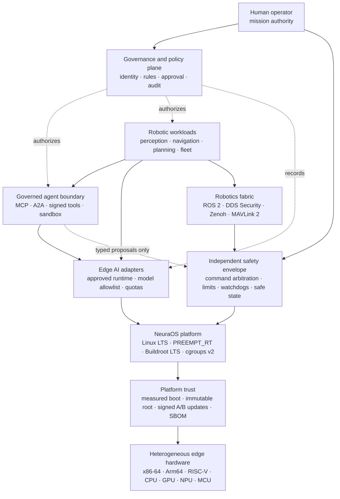

<div align="center">

# NeuraOS

### Governed edge intelligence for robotics and defence systems

**Deterministic control. Local AI. Human authority. Evidence by design.**

[](#development-status)
[](#verified-technology-baseline)
[](#verified-technology-baseline)
[](#post-quantum-cryptography)
[](#licence)

[Product](#product) · [Status](#development-status) · [Architecture](#architecture) · [Technology](#verified-technology-baseline) · [Governance](#governed-autonomy) · [Safety](#safety-envelope) · [Security](#security-baseline) · [PQC](#post-quantum-cryptography) · [Documentation](#documentation)

</div>

## Product

NeuraOS is an edge platform architecture for perception, sensor fusion, autonomous planning and local inference close to robotic hardware. It is designed for deployments where connectivity is intermittent, latency is bounded and consequential actions require explicit authority.

The public Git surface contains only this README. Implementation, build,
configuration, schema, evidence and detailed documentation paths named below
refer to the controlled local workspace; they are deliberately not published
or distributed through Git. Paths shown as inline code are local references,
not downloadable files in this repository.

Five principles define the product:

- **Edge sovereignty** — mission data and inference can remain on the device or inside a controlled boundary.
- **Bounded autonomy** — policy, time, geography, confidence and resource limits are enforced outside the model.
- **Deterministic safety** — probabilistic AI never replaces the command arbiter, emergency stop or independently assured controller.
- **Evidence-first engineering** — every model, configuration, update and decision is attributable, reviewable and reversible.
- **Open interoperability** — maintained robotics and inference interfaces are preferred over product-specific lock-in.

### Capabilities and controls

| Domain | Intended capability | Required control |
|---|---|---|
| Robotic perception | Multi-sensor detection, tracking and scene understanding | Confidence calibration, stale-data rejection and operator-visible uncertainty |
| Ground, air and maritime robotics | Navigation, route planning and vehicle integration | Independent motion controller, geofence and minimum-risk state |
| Multi-vehicle operations | Telemetry, task allocation and resilient coordination | Authenticated membership, rate limits and loss-of-link policy |
| Disconnected edge AI | Local vision, speech and language inference | Approved models only; no silent online learning |
| Governed AI agents | Tool use, task planning and peer-agent coordination | Signed tool manifests, deny-by-default broker, sandbox and human approval for consequential actions |
| Simulation and digital twins | SIL/HIL validation, deterministic replay and fault injection | Reproducible evidence, rollback proof and hazard traceability |

## Development status

NeuraOS now provides **version 1.0.0-rc.8, a bootable production candidate**. The repository builds a hash-locked x86-64 QEMU operating-system image from Buildroot 2025.02.17 LTS and Linux 6.18.49, embeds an explicit 19-package catalog resolving to 40 target components, and mounts its deterministic ext4 root through a dm-verity mapping. The deterministic C17 command arbiter and hash-linked audit reference run both on the host and inside the image.

This README consolidates the operating-system implementation, device and
vehicle contracts, governed-agent controls, digital rehearsal, global
applicability research and subsequent PQC work as of **5 September 2026**.
The current operating boundary is **QEMU and non-actuating simulation**.
There is no authorized physical deployment; **7 of 17 production gates are
satisfied and 9 field-readiness blockers remain open**.

### Delivery and verification record

| Area | Delivered and checked | Evidence boundary |
|---|---|---|
| Core software | 144 Python tests, C arbiter/audit tests, compiler analysis, Flake8, ShellCheck and ASan/UBSan passed | Host verification; target timing and independent safety review remain open |
| Contracts and documentation | 59 JSON schemas, 34 configuration instances and 51 Markdown documents checked | Structural validation and policy tests, not hardware qualification |
| Operating-system image | Clean rc.8 build; 19 explicit packages, 40 SBOM components, 57 kernel controls and 514 target commands verified | x86-64 QEMU reference profile |
| Binary hardening | 205 ELF objects checked for applicable PIE, NX stack, RELRO and immediate-binding requirements | Two named GCC runtime BIND_NOW exceptions; first-party stack-canary evidence required |
| Root integrity and boot | dm-verity boot passed; corrupted BusyBox block rejected; test-key Secure Boot and TPM measurements captured | QEMU, OVMF and swtpm; physical attestation pending |
| Updates and isolation | RAUC correct-key verification, wrong-key/tamper rejection, A/B state-machine tests and boot-time bubblewrap isolation checks | Physical flash/rollback and full agent-runtime enforcement pending |
| Repeatability and endurance | Five image hashes matched across same-output builds; 1,000,000 arbiter/audit cycles passed | Independent builder reproduction and physical endurance pending |
| Private source and supply chain | 217 exact rc.8 source inputs archived; CycloneDX inventory, SLSA provenance, legal inventory and vulnerability reconciliation generated | Source review, production signing and reviewed VEX pending |
| Devices and mobility | 12 researched support routes, 12 ordered bring-up stages, 11 platform classes and 17 protocol contracts validated | Six compute options evaluated; no physical target or vehicle adapter qualified |
| Simulation | 1,100/1,100 runs passed across 22 scenarios; eight backend contracts defined | Logical reference simulation; high-fidelity SIL/HIL backends require integration |
| Deployment applicability | 15 dimensions, 39 official-source instruments, 18 use cases and eight jurisdiction profiles checked | Deployment-specific legal and operational decisions remain external |
| Post-quantum cryptography | 39/39 checks passed for ML-KEM, ML-DSA, SLH-DSA and two strict hybrid TLS profiles | Target OpenSSL executed on a Linux host; supplementary work after the rc.8 image build |

The test counts describe different suites and are not combined into a single
certification score. Local records are retained under
`build/platform/output/evidence/`, `build/platform/output/release/`,
`build/release-source-evidence-rc8-final/` and
`build/pqc-selftest-20260905-final.json`. Public Git publishes this account of
the results; it does not distribute the private evidence bundles.

### Implemented controls and remaining work

The candidate profile was built and structurally verified on **5 September 2026**. A positive QEMU test boots through dm-verity; a negative test modifies one BusyBox data block and proves that the kernel rejects it before the health marker. A second QEMU path boots a test-key signed UKI with OVMF Secure Boot, swtpm TPM 2.0, PCR 0/2/4/7/10 and event-log evidence. The verifier checks every target ELF for PIE executables, non-executable stack and GNU RELRO, and requires immediate binding except for two narrowly named GCC runtime libraries. Five image artifacts are compared across consecutive same-output builds, and one million sequential arbiter/audit cycles run in one process. The installed RAUC 1.15.2 verifies an ephemeral-key signed bundle and rejects both a wrong key and tampered full payload. The installed bubblewrap launcher proves root-supervised namespace, privilege, filesystem, device and network-denial primitives at every boot.

The release pipeline emits CycloneDX 1.7 inventory, SLSA v1 provenance, Buildroot legal inventory, a digest-bound update manifest and architecture contracts. Because the public Git surface intentionally contains only this README, the release source identity is the SHA-256 of a sorted manifest covering every exact private build input; generation and verification re-hash those inputs, and a deterministic normalized archive can be retained for independent review. Pinned Grype 0.116.1 scans the candidate against a current database and preserves the raw report. Removing the unused target `jq` and refreshing GLib 2.88.3, libcap 2.78 and tpm2-tss 4.1.3 reduced the current scan to 189 matches, including 7 critical and 59 high. Deterministic reconciliation identifies seven exact Buildroot backport candidates and leaves 182 unresolved matches, including 7 critical and 58 high. Both categories remain `scanned-unreviewed` and production-blocking until independent product-security triage, signed VEX and risk-owner approval. The same review covers six physical edge-compute options and current agent/update standards. The MCP/A2A gateway, WasmEdge tool runtime, TUF/Uptane repository path and OpenTelemetry export remain selected contracts rather than installed or qualified target features.

**This is not production-authorized firmware.** The public release identity and candidate manifest are schema-locked to `production_authorized: false`. `make production-check` ignores mutable gate booleans and accepts only an immutable source digest, verified release/update Sigstore bundles and 14 fresh role-separated claims bound to exact evidence digests. Release signing, reviewed vulnerability/VEX disposition, independent reconstruction, physical measured boot and attestation, hardware-backed A/B anti-rollback, full target agent enforcement, target qualification and independent authorization remain open. Seven of seventeen machine-readable engineering gates are satisfied; none substitutes for deployment authorization.

**Field operation is also explicitly NO-GO.** No robot, autonomous road
vehicle or drone may be connected to an actuator and sent to a bench/HIL rig or
field under the current evidence. `make field-trial-status` verifies that this
denial still matches the repository facts. A separate fail-closed
`make field-trial-check` can derive a time-limited result only after an exact
physical production target, byte-bound trial plan, 1,000-scenario policy floor,
fault injection, independent stop/safe-state proof, named crew, site/legal
review and platform-specific signed claims exist. See the
field-trial readiness record (`docs/assurance/field-trial-readiness.md`).

Custom hardware now has a separate fail-closed intake path. Twelve researched
silicon, SOM, system and design/manufacturing routes are recorded with their
official limitations. Exact hardware/BOM, BSP and firmware locks, boot and
recovery path, provisioning, bus/driver/firmware/calibration ownership and
twelve ordered bring-up gates are schema validated. The scaffold never emits a
working flash command or production defconfig, and its digest-bound evidence
state cannot grant production or field authority. See the
device support ecosystem (`docs/reference/device-support-ecosystem.md`) and
custom-device onboarding procedure (`docs/how-to/onboard-custom-device.md`).

This distinction is deliberate:

- `candidate` means implemented and exercised by host or QEMU release checks;
- `available` means implemented and exercised by a narrower host check;
- `planned` means architecturally selected but not yet qualified;
- no README statement is a certification, airworthiness approval or operational authorization.

See the delivery roadmap (`docs/ROADMAP.md`) and control matrix (`docs/assurance/control-matrix.md`) for the evidence required to advance each capability.

### Work delivered across releases

| Milestone | Delivered scope |
|---|---|
| 0.1–0.2 foundation | Product and technology contracts, deterministic C core, hash-locked Buildroot/Linux image and hardened read-only runtime |
| rc.1 | dm-verity positive/negative boots, reproducible artifacts, SBOM/provenance/legal inventory and A/B update policy |
| rc.2–rc.3 | Device research, governed agent contracts, RAUC and bubblewrap installation, QEMU Secure Boot/TPM, vulnerability scanning and signed-evidence promotion workflows |
| rc.4–rc.5 | Custom-device onboarding, peripheral ownership, staged bring-up, civil/non-weapon mobility classes and bounded gateway/conformance tooling |
| rc.6–rc.7 | Multi-domain simulation campaign, external SIL/HIL evidence contracts, global applicability assessment and deployment-specific field authorization checks |
| rc.8 | Security package refresh, unused `jq` removal, vulnerability reconciliation, complete private-source identity, stale-build invalidation and all-target ELF hardening |
| After the rc.8 image build | Two opt-in PQC TLS profiles, ML-KEM/ML-DSA/SLH-DSA capability tests and the consolidated public README; no new firmware version or production authorization |

## Architecture



The governance plane issues bounded authority and records evidence; it is not required in each real-time cycle. MCP and A2A terminate before the tool broker, and a broker allow means only that a sandbox may launch. The safety envelope remains deterministic and can reject, pause or override AI-originated commands. Primary flight, motion and emergency-protection loops remain outside the AI workload.

Read the architecture reference (`docs/reference/architecture.md`), agent runtime contract (`docs/reference/agent-runtime.md`), device selection register (`docs/reference/autonomous-device-profiles.md`), device support ecosystem (`docs/reference/device-support-ecosystem.md`) and decision records in docs/adr (`docs/adr/README.md`) before implementing a platform component.

### Autonomous-device selection

The researched register does not pretend that a family name is a production target. Exact module, carrier, BSP, firmware, accelerator and lifecycle evidence must be locked together.

| Family | Decision | Verified maturity | NeuraOS posture |
|---|---|---|---|
| NVIDIA Jetson AGX Orin Industrial | Candidate | Production module listed through July 2033 | Strong rugged GPU option; exact carrier/BSP and boot trust unqualified |
| Qualcomm Dragonwing IQ-9075 | Evaluation | Official product page active; longevity catalogue still says sampling | Do not select until an orderable production module and BSP are locked |
| NXP i.MX 95 Industrial | Candidate | Industrial family with EdgeLock and long-life program | Strong application/real-time/security partition candidate; exact SKU/SOM required |
| AMD Kria K26 Industrial | Candidate | Production-qualified industrial SOM | Useful FPGA/robotics path; bitstream joins the signed boot and release chain |
| Intel Core Ultra Series 3 for Edge | Evaluation | Edge family; selected products advertise long availability | Lowest-friction x86 path, but exact embedded SKU/board is unselected |
| Hailo-10H | Evaluation add-on | Commercially available M.2 accelerator | Never a controller; qualify firmware, compiler and model with its host |

Developer and evaluation kits remain lab equipment. None of the six physical options is `qualified` or `production_authorized` in `config/device-profiles.json`.

The support catalogue adds twelve researched vendor/partner routes without
changing that verdict. A live target begins from the
device-onboarding contract (`config/device-onboarding.example.json`), never by
copying a development-kit image into production.

### Multi-domain mobility boundary

Version 1.0.0-rc.8 carries explicit contract-only profiles for industrial robots,
AMRs, civil road and off-road vehicles, UAS, surface vessels and underwater
vehicles, plus separate **non-weapon** defence profiles for ground, air,
surface and subsea systems. The catalogue binds each class to its own
independent controller, standards, protocol locks and conformance gates; all
11 classes remain unqualified and unauthorized.

The mobility gateway accepts only exact-identity, fresh, monotonic,
SI-unit/owned-frame, bounded high-level proposals. It rejects direct actuation,
replay, cross-vehicle routing, stale approval and limit excess. Weapon arming
or firing, target engagement, lethal-force authority, safety/geofence/
collision-avoidance bypass and Remote ID/transponder disable are globally
forbidden for every class. See the
platform reference (`docs/reference/mobility-platforms.md`),
integration procedure (`docs/how-to/integrate-mobility-platform.md`) and
conformance status (`docs/assurance/multi-domain-conformance.md`).

### Digital field rehearsal

The rc.8 candidate includes a deterministic, non-actuating simulation campaign
that executes 1,100 runs over 22 scenarios. Every one of the 11 platform
classes receives an injected-fault scenario and a separate forbidden weapon
command test. The campaign covers factory, warehouse, road, worksite,
airspace, coastal and subsea emulations; sensor, actuator, link, replay,
clock, compute, power, obstacle, geofence and identification failures enter a
simulated minimum-risk stop. The complete report is replayed byte-for-byte.

Gazebo Jetty, PX4/ArduPilot SITL, CARLA 0.10.0, Webots R2025a, VRX 3.1.0 and
Stonefish 1.6.0 are exact-backend contracts, not installed target features.
External SIL/HIL evidence must bind the adapter, executable or container,
world, vehicle, sensor, parameters and results by SHA-256. HIL additionally
requires controller identity and actuator isolation proof. No simulation
result can self-authorize a physical target or field operation. See the
rehearsal procedure (`docs/how-to/run-digital-field-rehearsal.md`) and
simulation assurance record (`docs/assurance/simulation-readiness.md`).

### Global deployment applicability

The rc.8 applicability layer models 15 regulatory and assurance dimensions,
39 official-source instruments, 18 civil and non-weapon use cases and eight
representative jurisdiction profiles. It spans industrial, logistics,
agriculture, forestry, mining, construction, road, healthcare, energy, rail,
aviation, port, offshore, subsea, environmental, emergency-response, public
safety, municipal and non-weapon defence-support operations.

The resolver never grants deployment authority. A recognized single-country
overlay can produce only `independent-authorization-required`; an unknown or
cross-border jurisdiction, stale catalogue, platform/environment mismatch,
online learning request, weapon function, target engagement or lethal-force
semantics produces `unsupported-no-go`. The exact report is replay-verified and
bound into the field-trial plan before independent legal, spectrum, airspace,
road, maritime, safety and cybersecurity evidence can be reviewed. The
catalogue is an engineering applicability aid, not legal advice, certification
or a claim of exhaustive worldwide law. See the
global applicability reference (`docs/reference/global-deployment-applicability.md`),
assessment procedure (`docs/how-to/assess-global-deployment.md`) and
assurance record (`docs/assurance/global-deployment-readiness.md`).

## Verified technology baseline

The baseline separates long-lived foundations from feature runtimes. Release builds must replace human-readable versions with immutable source revisions and cryptographic hashes. Versions below were checked against official upstream channels on **5 September 2026**; the machine-readable record is `config/technology-baseline.json`.

| Layer | Verified release | Purpose | Adoption |
|---|---|---|---|
| Kernel | [Linux 6.18 LTS](https://www.kernel.org/releases.html) + PREEMPT_RT; QEMU profile pin 6.18.49 | Long-lived real-time-capable platform | Active production-candidate profile |
| Embedded build | [Buildroot 2025.02.17 LTS](https://buildroot.org/download.html) · 2026.08 current stable | Reproducible, board-specific images | Active LTS profile; stable line evaluated only |
| Post-quantum cryptography | [OpenSSL 3.5.8 LTS](https://openssl-library.org/source/) · NIST FIPS 203/204/205 · [RFC 10024](https://www.rfc-editor.org/rfc/rfc10024.html) | ML-KEM hybrid TLS, ML-DSA and SLH-DSA primitives | Installed primitives exercised; two opt-in TLS profiles tested on host; service adoption pending |
| Robotics | [ROS 2 Lyrical Luth](https://docs.ros.org/en/lyrical/) LTS through May 2031 | Lifecycle, execution and ecosystem APIs | Planned adapter |
| Real-time data | [Fast DDS 3.6.2](https://github.com/eProsima/Fast-DDS/releases/tag/v3.6.2) + DDS Security | Authenticated QoS and shared-memory pub/sub | Planned adapter |
| Edge fabric | [Eclipse Zenoh 1.10.0](https://github.com/eclipse-zenoh/zenoh/releases/tag/1.10.0) | Local-first pub/sub, query and disrupted-link operation | Planned adapter |
| Vehicle API | MAVLink 2 signing + [MAVSDK 3.17.4](https://github.com/mavlink/MAVSDK/releases/tag/v3.17.4) | Authenticated vehicle telemetry and commands | Planned adapter |
| Autopilot adapters | [PX4 1.17.0](https://github.com/PX4/PX4-Autopilot/releases/tag/v1.17.0) · [ArduPilot 4.7.1](https://github.com/ArduPilot/ardupilot/releases/tag/Copter-4.7.1) | Companion integration; never primary safety authority | Planned adapter |
| Simulation and scenarios | Gazebo Jetty · CARLA 0.10.0 · Webots R2025a · VRX 3.1.0 · Stonefish 1.6.0 · ASAM OpenSCENARIO DSL 2.2.0/XML 1.4.0 | Deterministic regression plus exact-backend SIL/HIL contracts | Reference runner active; high-fidelity backends contract-only |
| Portable inference | [ONNX Runtime 1.29.0](https://github.com/microsoft/onnxruntime/releases/tag/v1.29.0) | Cross-platform execution-provider boundary | Planned adapter |
| On-device ML | [LiteRT 2.2.0](https://github.com/google-ai-edge/LiteRT/releases/tag/v2.2.0) · [ExecuTorch 1.4.1](https://github.com/pytorch/executorch/releases/tag/v1.4.1) | AOT compilation, quantization and device delegates | Planned adapter |
| Intel inference | [OpenVINO 2026.3.1](https://github.com/openvinotoolkit/openvino/releases/tag/2026.3.1) | CPU, integrated GPU and NPU inference | Planned adapter |
| Vision | [OpenCV 5.0.0](https://github.com/opencv/opencv/releases/tag/5.0.0) · [ncnn 20260526](https://github.com/Tencent/ncnn/releases/tag/20260526) | C++17 vision and compact native inference | Planned adapter |
| Local generative AI | [llama.cpp 0.4.0](https://github.com/ggml-org/llama.cpp/releases/tag/v0.4.0) | Offline, resource-bounded language assistance | Planned adapter |
| Sandboxed extensions | [WasmEdge 0.17.1](https://github.com/WasmEdge/WasmEdge/releases/tag/0.17.1) + [bubblewrap 0.11.2](https://github.com/containers/bubblewrap/releases/tag/v0.11.2) | Portable tool runtime plus boot-tested process isolation | Wasm runtime planned; launcher installed |
| NVIDIA edge stack | [JetPack 7.2.1](https://developer.nvidia.com/embedded/jetpack-archive) | Vendor BSP/CUDA stack for evaluated Jetson profiles | Planned board-specific adapter |
| Agent tool/context protocol | [MCP 2026-07-28](https://modelcontextprotocol.io/specification/2026-07-28) | Normalized tool and context interoperability behind the broker | Selected contract; not integrated |
| Agent-to-agent protocol | [A2A 1.0.0](https://a2a-protocol.org/latest/specification/) | Authenticated peer-agent task interoperability | Selected contract; not integrated |
| Target update installer | [RAUC 1.15.2](https://rauc.readthedocs.io/en/latest/changes.html) | Signed bundle verification and inactive-slot installation | CLI installed; physical slots pending |
| Update metadata | [TUF 1.0.36](https://theupdateframework.github.io/specification/latest/) · [Uptane 2.1.0](https://uptane.org/docs/latest/all-versions) | Repository-compromise resistance and multi-controller vehicle/fleet profiles | Selected contract; not integrated |
| Observability | [OpenTelemetry 1.60.0](https://opentelemetry.io/docs/specs/otel/) | Portable traces/metrics/log correlation around local evidence | Selected contract; export disabled by default |
| Artifact signing | [Sigstore Cosign 3.1.3](https://github.com/sigstore/cosign/releases/tag/v3.1.3) | Signature bundles and transparency evidence | Release control |
| Vulnerability scanning | [Grype 0.116.1](https://github.com/anchore/grype/releases/tag/v0.116.1) | SBOM scanning with database provenance and retained raw findings | Active release control; disposition pending |
| Supply-chain evidence | [SLSA 1.2](https://slsa.dev/spec/v1.2/) · [SPDX 3.0.1](https://spdx.github.io/spdx-spec/v3.0.1/) · [CycloneDX 1.7](https://cyclonedx.org/specification/overview/) | Provenance, SBOM, VEX and inventory | Release control |

“Planned adapter” and “selected contract” are not promises to place every runtime in every image. A board profile includes only the smallest qualified set needed for its mission. Installing all listed packages would increase vulnerability, licence, timing and verification scope; image minimization is an explicit security control.

The exact installed reference set and activation state live in the package catalog (`config/package-catalog.json`). Buildroot and Linux inputs are independently pinned in the source lock (`config/source-lock.json`).

### Release discipline

- Foundation components remain on supported LTS tracks.
- Candidate images use immutable primary-source pins, verified hashes, CycloneDX inventory and SLSA provenance; a reviewed VEX and detached signatures remain mandatory production gates.
- Runtime updates pass API/ABI review, model compatibility, deterministic replay, SIL/HIL regression and rollback rehearsal.
- Security fixes may move a pin outside the scheduled cadence but never bypass verification or authorization.

## Governed autonomy

NeuraOS applies the continuous functions in [NIST AI RMF 1.0](https://www.nist.gov/itl/ai-risk-management-framework)—Govern, Map, Measure and Manage—and treats the principles in [NATO's revised AI strategy](https://www.nato.int/en/about-us/official-texts-and-resources/official-texts/2024/07/10/summary-of-natos-revised-artificial-intelligence-ai-strategy) as defence-domain design inputs. NIST is revising AI RMF 1.0; NeuraOS will review the baseline when a successor is finalized.

AI components may detect, classify, summarize, recommend, prioritize and plan inside approved constraints. They may not independently:

- change mission objectives or widen geographic, temporal or policy boundaries;
- disable watchdogs, safety interlocks, audit capture or human override;
- approve their own models, updates, privileges or operational authorization;
- conceal uncertainty, discard required evidence or silently learn from live operations;
- become the sole authority for a safety-critical or irreversible action.

Agent planners inherit the same restrictions. Tool descriptions, MCP resources, A2A Agent Cards, model output, retrieved text and sensor labels are untrusted data and cannot grant capability. A signed tool manifest can only narrow authority; it cannot bypass the deterministic command arbiter.

See governed autonomy (`docs/explanation/governed-autonomy.md`), the threat model (`docs/assurance/threat-model.md`) and the security policy (`SECURITY.md`).

## Safety envelope

NeuraOS treats AI as a fallible proposal source. Safety depends on independently testable controls:

1. **Command arbitration** validates identity, authority, freshness, sequence, state and command range.
2. **Spatial and temporal constraints** enforce geofences, speed/altitude limits, mission windows and resource budgets outside models.
3. **Sensor validity** rejects stale, contradictory, spoofed or physically implausible observations.
4. **Health supervision** monitors deadlines, heartbeat loss, thermal/power limits, memory pressure and degraded modes.
5. **Independent override** provides authenticated operator control, hardware emergency stop where applicable and a predefined minimum-risk state.
6. **Recovery discipline** makes rollback, last-known-good boot and evidence preservation part of the safety case.

The reference core implements item 1 and the software stop latch in item 5 on the host and in the QEMU image. Vehicle-specific STPA, FMEA/FMECA, fault-tree and SIL/HIL evidence remains required. See why safety is separated (`docs/explanation/safety-separation.md`).

## Security baseline

| Domain | Required posture |
|---|---|
| Root of trust | Test-key OVMF Secure Boot and TPM measurements pass in QEMU; physical protected keys, quotes and attestation remain a production gate |
| Operating system | Minimal read-only image with enforced dm-verity in QEMU; IMA/EVM, least privilege, cgroups v2 and LSM/seccomp capabilities |
| Identity | Unique workload/device identity, short-lived credentials, role separation and deny-by-default authorization |
| Network | Segmentation, mutual authentication, DDS Security, protected management and explicit offline mode |
| Quantum resistance | Explicit hybrid ML-KEM TLS profiles, ML-DSA signature migration and SLH-DSA diversity; [verified scope and adoption requirements](#post-quantum-cryptography) |
| Models and data | Signed allowlist, digest verification, encrypted sensitive storage, provenance and retention policy |
| Updates | RAUC is installed and signed-bundle rejection is tested; physical A/B flash, protected anti-rollback, staged rollout and recovery remain gated |
| AI agents | Bubblewrap isolation primitives run at boot; authenticated MCP/A2A, signed tools, Wasm execution, quotas and target conformance remain gated |
| Supply chain | Reproducible build, SBOM/VEX, SLSA provenance, vulnerability triage and licence inventory |
| Audit | Append-oriented, time-synchronized, tamper-evident events with redaction, retention and controlled export |

The cybersecurity model follows [NIST CSF 2.0](https://www.nist.gov/cyberframework). Threat analysis includes compromised updates, malicious peripherals, sensor/GNSS deception, adversarial examples, prompt/tool injection, poisoning, model extraction, insider risk, denial of service and disrupted communications.

### Post-quantum cryptography

NeuraOS selects **post-quantum cryptography (PQC)** to protect long-lived device,
fleet and agent communications against future quantum attacks, including
traffic collected today for later decryption. The baseline uses the finalized
[ML-KEM / FIPS 203](https://csrc.nist.gov/pubs/fips/203/final),
[ML-DSA / FIPS 204](https://csrc.nist.gov/pubs/fips/204/final) and
[SLH-DSA / FIPS 205](https://csrc.nist.gov/pubs/fips/205/final) standards.
These algorithms run on conventional computers. Standards and implementation
support were checked on **5 September 2026**.

The installed **OpenSSL 3.5.8** supplies these primitives natively; no
experimental provider is needed for this baseline. Its 3.5 LTS branch is
supported through **8 April 2030**. Newer 3.6 and 4.0 branches exist; the choice
here is the maintained LTS branch with its current security fixes.
See the [official release and support table](https://openssl-library.org/source/).

| Use | NeuraOS selection | Implemented and verified scope |
|---|---|---|
| General device, fleet and agent TLS | TLS 1.3, `X25519MLKEM768`, `TLS_AES_256_GCM_SHA384` | Balanced profile (`config/pqc-balanced.cnf`); successful mutually authenticated loopback connection with the built target OpenSSL |
| Higher-margin TLS endpoints | TLS 1.3, `SecP384r1MLKEM1024`, `TLS_AES_256_GCM_SHA384` | High-assurance profile (`config/pqc-high-assurance.cnf`); same positive and negative connection checks; hardware performance qualification pending |
| Artifact, model and tool signature migration | `ML-DSA-65`; `ML-DSA-87` for higher-margin profiles | Detached signing and verification exercised; production release and tool verifiers still require integration |
| Hash-based signature diversity | `SLH-DSA-SHA2-256s` for evaluation of infrequent offline signing and recovery | Detached signing and rejection tests exercised; larger signatures and signing cost require use-case qualification |

The hybrid groups are specified by **RFC 10024**, published in August 2026.
They combine ECDHE and ML-KEM within TLS; ML-KEM establishes a shared secret,
while AES-GCM protects application records. Both NeuraOS profiles require
TLS 1.3 and allow only their named hybrid group, so a classical-only peer is
rejected. These are process-level OpenSSL configurations: applications must
explicitly load the selected profile and must not override its settings.
See the [TLS specification](https://www.rfc-editor.org/rfc/rfc10024.html) and
[OpenSSL configuration interface](https://docs.openssl.org/3.5/man5/config/).

**Hybrid key establishment does not by itself provide PQ authentication.**
The tested TLS identities use ephemeral ECDSA P-384 certificates with explicit
trust and hostname checks. ML-DSA handshake authentication remains a separate
integration track: its TLS specification is still
[draft-ietf-tls-mldsa-05](https://datatracker.ietf.org/doc/draft-ietf-tls-mldsa/)
at this review. Installed ML-DSA primitives do not establish that RAUC, Sigstore,
UEFI Secure Boot, TPM attestation, DDS, MAVLink or the agent gateway already
authenticate with PQ signatures. The current boot and release chains retain
their existing verification schemes.

Adoption requirements for the selected profiles are:

- Load `config/pqc-balanced.cnf` or `config/pqc-high-assurance.cnf` through the
  service's `OPENSSL_CONF`; configure peer trust, mutual authentication,
  identity authorization, credential rotation and revocation in the service.
  Keep TLS 0-RTT disabled for commands and updates. Existing network services
  are not automatically reconfigured by adding these files.
- Maintain an inventory of algorithm, key purpose, provider version,
  certificate chain, peer support and data lifetime. Prioritize sensitive
  long-retention data; separate legacy endpoints from PQC-required endpoints
  without automatic downgrade or retry into a classical-only connection.
- Bind future PQ artifact signatures to the same exact payload, signer role,
  purpose and version as the release policy. During any dual-signature
  transition, require both policy-selected signatures; reject a missing PQ
  signature. This verifier migration is not implemented by the primitive test.
- Use vetted OS entropy and supported key storage; qualify any HSM, TPM or
  secure element for the exact algorithm and operation. Measure handshake
  size, MTU/fragmentation, reconnect cost, CPU/RAM, latency and denial-of-service
  limits on each board and link. Keep cryptographic handshakes outside primary
  motion and emergency-control loops.

**Verified locally:** the supplementary
PQC self-test (`tools/pqc_selftest.py`) passed **39 checks** using the actual
target musl/OpenSSL executable and libraries on an x86-64 Linux host. It covers
ML-KEM-768/1024 round trips and corrupt/wrong-key/truncated ciphertexts;
ML-DSA-65/87 and SLH-DSA signatures with altered messages, altered signatures,
wrong keys and wrong contexts; and both TLS profiles with rejection of
classical-only groups, TLS 1.2, AES-128-only negotiation, wrong hostnames,
untrusted servers, missing client certificates and untrusted clients.
ML-KEM's implicit rejection is checked by confirming that corrupt ciphertext
produces a different shared secret, rather than expecting a process error.

```bash
python3 tools/pqc_selftest.py --report build/pqc-selftest.json
```

The report refuses overwrite, records hashes of the tested binaries, profiles
and runner, and retains no test private keys or shared secrets. It is
supplementary host evidence, not a QEMU boot test, independent interoperability
test, ACVP validation or physical-device assessment. The profiles and harness
are additions after the rc.8 image build; they do not change its archived
release evidence or authorize production deployment.

**Quantum key distribution (QKD)** needs dedicated optical hardware and an
authenticated classical channel; it is not a software package that makes a
robot or radio link quantum-secure. No QKD hardware is selected or integrated.
Its deployment limitations are described in the
[NSA QKD guidance](https://www.nsa.gov/Cybersecurity/Post-Quantum-Cybersecurity-Resources/).
[HQC is selected for future NIST standardization](https://csrc.nist.gov/Projects/post-quantum-cryptography/post-quantum-cryptography-standardization/selected-algorithms)
and remains a diversification watch item, not an enabled fallback.
Using FIPS-standard algorithms does not make this Buildroot image
**FIPS 140-3 validated**, **CNSA 2.0 approved** or universally quantum-proof;
those claims require the applicable module, system and deployment evidence.

### Assurance alignment

Controls are mapped to the standards applicable to each deployment, including [NIST AI RMF 1.0](https://www.nist.gov/publications/artificial-intelligence-risk-management-framework-ai-rmf-10), [NIST CSF 2.0](https://www.nist.gov/publications/nist-cybersecurity-framework-csf-20), [ISO/IEC 42001:2023](https://www.iso.org/standard/42001), [Regulation (EU) 2024/1689](https://eur-lex.europa.eu/eli/reg/2024/1689/oj) where applicable, and relevant IEC 61508, ISO 26262, ISO 21448, ISO/SAE 21434, UL 4600, airworthiness or maritime regimes.

Alignment describes engineering intent; it is not a certification or legal conclusion. Jurisdiction, system classification and conformity obligations must be decided for each deployment.

## Documentation

This README is the complete public documentation entry point. The following
map is for collaborators with access to the controlled local workspace;
cloning the public repository does not provide these files or build tools.
The local documentation separates tutorials, procedures, references, design
rationale and assurance records.

| Need | Start here |
|---|---|
| Understand the repository | Documentation map (`docs/README.md`) |
| Exercise the safety kernel | Host safety lab (`docs/tutorials/host-safety-lab.md`) |
| Build or integrate | Build the core (`docs/how-to/build-core.md`) · Build and boot the OS image (`docs/how-to/build-image.md`) · Onboard a custom device (`docs/how-to/onboard-custom-device.md`) |
| Inspect contracts | Runtime API (`docs/reference/runtime-api.md`) · JSON schemas (`schemas/README.md`) |
| Inspect the platform | Package catalog (`docs/reference/package-catalog.md`) · Architecture (`docs/reference/architecture.md`) · Device profiles (`docs/reference/autonomous-device-profiles.md`) · Device support ecosystem (`docs/reference/device-support-ecosystem.md`) |
| Inspect agent controls | Governed agent runtime (`docs/reference/agent-runtime.md`) · Agent policy reference (`tools/agent_policy.py`) |
| Review delivery risk | Roadmap (`docs/ROADMAP.md`) · Control matrix (`docs/assurance/control-matrix.md`) |
| Assess country and use-case applicability | Global deployment assessment (`docs/how-to/assess-global-deployment.md`) |
| Decide whether a physical trial may start | Field-trial readiness (`docs/assurance/field-trial-readiness.md`) |

```text
core/       bounded C17 arbiter, audit chain, CLI and host tests
board/      read-only QEMU rootfs policy, users and boot health services
config/     release/update policy, device/agent/onboarding profiles, production gates and source locks
configs/    active Buildroot and Linux production-candidate profile
package/    Buildroot external packages
schemas/    policy, model-manifest and audit-event contracts
docs/       tutorials, procedures, references, rationale, assurance and ADRs
tools/      image/release builders, device intake, dm-verity tests, A/B simulator and verifiers
build/      local images, retained reports and private source archives; never published
```

With access to the full private workspace on a supported Linux host, build
and verify the reference operating system:

```bash
make check
make sanitize
make release-candidate
python3 tools/pqc_selftest.py --report build/pqc-selftest.json
```

`make release-candidate` verifies source hashes, the final Buildroot selection, kernel controls, locked accounts, the absence of setuid/setgid files, dm-verity positive and negative boots, test-key Secure Boot and TPM measurements, signed RAUC bundle rejection, five same-output image digests, a current vulnerability scan, legal inventory and the release evidence bundle. The PQC command is a separate supplementary check and requires a new report filename on each retained run. `make production-check` is intentionally rejected until every signed external gate is satisfied, and `make field-trial-check` adds a further exact-system/site/crew/legal authorization layer. See the image build procedure (`docs/how-to/build-image.md`), signed promotion procedure (`docs/how-to/promote-production.md`), production-readiness record (`docs/assurance/production-readiness.md`) and field-trial decision (`docs/assurance/field-trial-readiness.md`).

## Public repository

This public Git repository is the product and assurance overview for NeuraOS;
only `README.md` is published. The deliberately bounded, non-operational QEMU
production candidate and its evidence remain in the controlled local workspace.

- The C17 reference demonstrates bounded command arbitration and hash-linked audit events; it is not a vehicle controller or certified safety component.
- Git does not distribute source code, build inputs, evidence, production
  firmware, trained models, operational configuration or binary releases.
- Public issues are for non-sensitive product and documentation feedback only.
- Do not submit classified, export-controlled, operational, personal or vulnerability-sensitive information.
- Report vulnerabilities through GitHub's
  [private reporting channel](https://github.com/neuraparse/neuraos/security/advisories/new)
  when available. Otherwise contact [info@neuraparse.com](mailto:info@neuraparse.com)
  with a minimal, non-sensitive request for a secure channel; do not include
  exploit material or credentials in the initial message.

## Licence

Copyright © 2024–2026 NeuraParse. **All rights reserved.** NeuraOS-specific materials are proprietary unless NeuraParse grants rights in a separate written agreement. Without that agreement, no licence is granted to use, copy, modify, merge, publish, distribute, sublicense, reverse engineer or create derivative works from these materials. Licensing enquiries: [info@neuraparse.com](mailto:info@neuraparse.com).

Third-party projects remain governed by their own licences, notices and source-availability obligations. Listing a project in the technology baseline does not bundle or redistribute it.

---

<div align="center">

**NeuraOS** · Governed at the edge · Designed for evidence · Built around human authority

[Website](https://neuraparse.com) · [Repository](https://github.com/neuraparse/neuraos) · [Issues](https://github.com/neuraparse/neuraos/issues) · [Security](https://github.com/neuraparse/neuraos/security)

</div>
