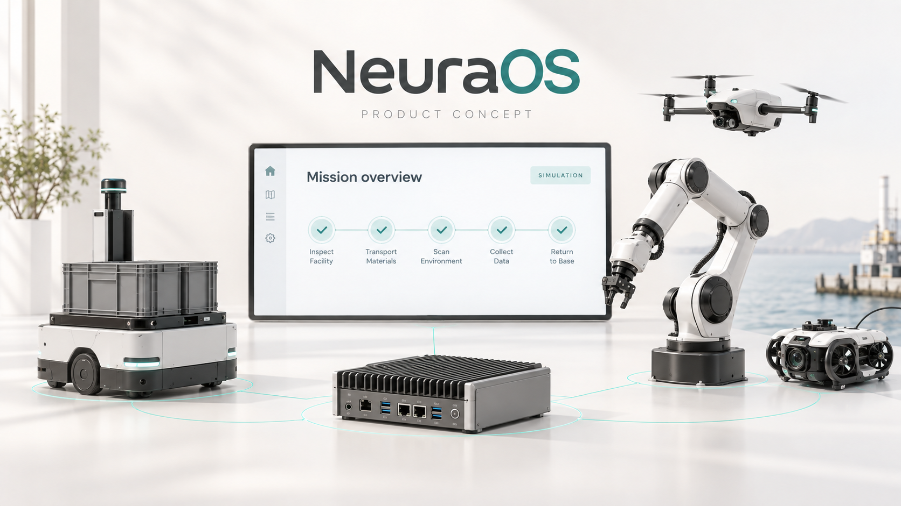
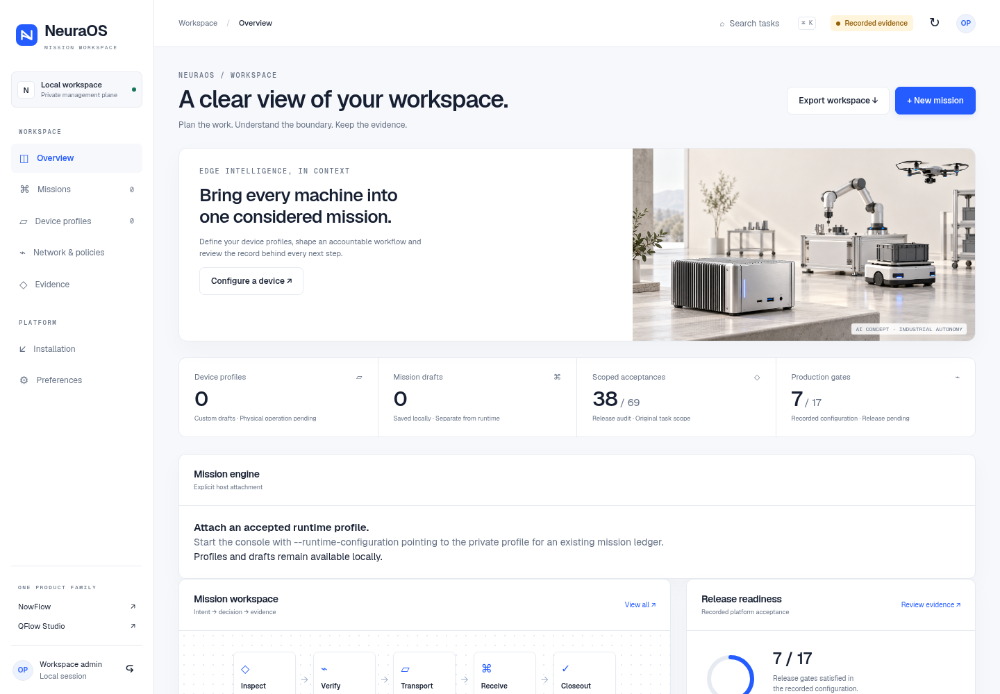
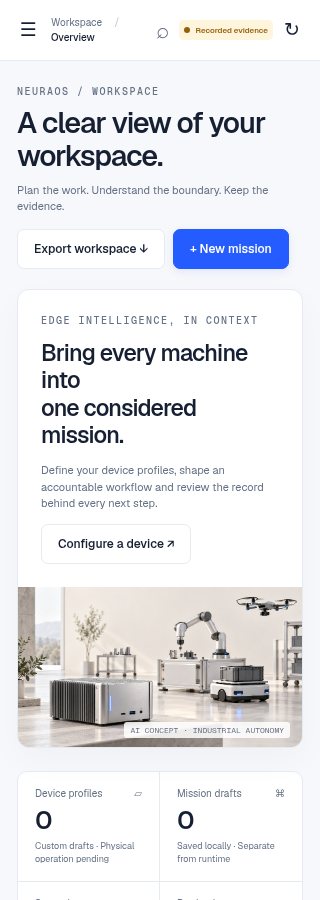
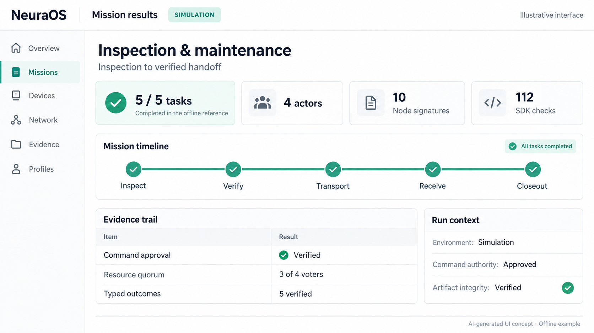
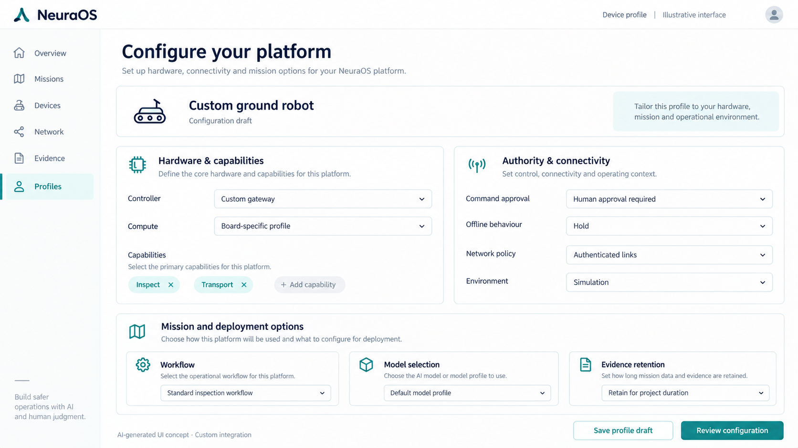

# NeuraOS

### Intelligent machines. Coordinated missions. Accountable action.

**The edge foundation for robotics, autonomous devices and governed AI.**

[Explore capabilities](#what-your-team-can-do) · [Connected products](#connected-products) · [Device coverage](#devices-and-integration-coverage) · [Customize](#customize-your-platform) · [Request a walkthrough](mailto:info@neuraparse.com?subject=NeuraOS%20Product%20Walkthrough)

AI-generated platform concept · September 2026 product brief

NeuraOS connects **mission coordination, device identity, network-aware decisions and verifiable results** on an edge software foundation. It gives robotics teams a common way to define a job, assign capable devices, approve commands and keep the evidence attached to the outcome.

Connect it with **NowFlow** for mission workflows and human approvals. Apply the **NODERIQ** coordination approach to shared context, task recommendations and constrained resources. Extend the device contracts to your own robot, controller or sensor.

**For robotics OEMs, fleet integrators and teams building custom intelligent machines.**

## Explore the working console

Actual R75 Linux HTTPS reference console · 1440 px browser capture · unbound local workspace

The seven-page console brings missions, device profiles, network policy, evidence and installation choices into one light workspace. It uses Geist typography and a labelled AI-generated hero image. The same interface reflows on narrow screens. The mobile menu has a visible close button, a backdrop and contained keyboard focus.

Actual R75 Docker reference console · 320 px browser capture

The screenshots show the implemented reference UI. The separate product and result illustrations below are AI-generated concepts; they do not represent deployed customer systems.

## What your team can do

| Capability | What it gives your team |
|---|---|
| Coordinate a mission across devices | Define task dependencies, match capabilities, reserve shared resources and track verified completion. |
| Make useful task recommendations | Use fresh context, device availability and estimated ETA/energy costs to propose feasible assignments. |
| Keep command authority explicit | Bind a command to an approved mission, named identity, allowed capability and validity window. |
| Handle degraded connectivity | Evaluate link freshness, delay, loss and device readiness before admitting work; retain uncertain resource ownership for reconciliation. |
| Prevent duplicate execution | Persist command intent, reject changed replayed payloads and fence stale generations and epochs. |
| Produce a reviewable result | Connect signed commands, acknowledgements, typed outcomes and artifact integrity to one mission record. |

These capabilities are implemented in the current host software reference. Device-specific transports and physical control paths are integrated against a defined platform profile.

## See the mission outcome

AI-generated interface concept. The figures describe the verified five-task offline reference; this is a product-design illustration.

**Inspection → verification → transport → receipt → closeout.**

The reference workflow moves an inspection result through review, service-kit transport, workcell handoff and final verification. Each task finishes with a typed result. A delivery acknowledgement records acceptance; completion requires the expected evidence.

| Stage | Example actor | Result attached to the mission |
|---|---|---|
| Inspect | Sensor or inspection device | Measurement artifact |
| Verify | Governed verifier | Verification artifact |
| Transport | Ground robot | Delivery artifact |
| Receive | Workcell device | Placement artifact |
| Closeout | Governed verifier | Final verification artifact |

The same mission structure gives teams a starting point for inspection-to-maintenance, AMR-to-workcell handoffs, remote evidence collection and custom sensor workflows.

## Connected products

Each product has a clear role in the integration.

| Product | Role with NeuraOS | Current integration scope |
|---|---|---|
| **NeuraOS** | Edge operating-system foundation, mission admission, durable device intent and evidence controls | Host software and bootable QEMU reference |
| **[NowFlow](https://nowflow.io/)** | Mission composition, governed agents, human review and workflow evidence | Actual device-adapter SDK and mission-schema integration verified through the offline Python/C/Node path |
| **[NODERIQ](https://neuraparse.com/research/noderiq/)** | Shared operational context and coordination research | Classical advisory assignment and verification components implemented; broader programme evaluation continues |
| **[QFlow Studio](https://qflow.studio/)** | Separate quantum workflow and experiment-evidence product in the Neura Parse family | Design and evidence-quality reference; no NeuraOS runtime dependency or quantum hardware integration claimed |
| **Your robot, fleet or controller** | Device capabilities, telemetry, command mapping and local control | General/custom profiles and adapter scaffolds; native acceptance is specific to the selected device |

**Compose the mission. Review the decision. Admit the command. Verify the result.**

NeuraOS preserves this chain across product boundaries. Required approval, resource ownership and evidence remain explicit as a workflow reaches a device.

## Devices and integration coverage

The device contract covers **eight domains**. The current SDK verification exercises **nine domain/protocol combinations**.

| Device family | Integration choices | Current software coverage |
|---|---|---|
| Ground robots and AMRs | ROS 2, MQTT, HTTP, custom gateway | Capability, mission, resource and SDK profile contracts |
| Industrial robots and workcells | HTTP or custom gateway; vendor controller mapping | Handoff, placement and evidence contracts |
| Inspection drones | MAVLink or custom gateway; companion/vendor route | SDK profiles, signed readiness gates and a narrow signed MAVLink telemetry ingress |
| Surface vessels | Custom gateway or controller-specific route | Maritime device and mission contracts |
| Underwater robots and ROVs | Companion or custom gateway | Profile, evidence and declared recovery contracts |
| Sensors | DDS, MQTT or HTTP | Source identity, freshness and typed observation contracts |
| Custom hardware | Board/controller-specific gateway | Intake, peripheral manifest and generated adapter scaffold |
| Governed agents | HTTP or custom gateway | Scoped capabilities, recommendations and verification tasks |

The SDK's protocol labels describe integration contracts. Native wire implementations, firmware compatibility and physical behaviour are accepted separately for the exact controller and operating environment.

### Robot manufacturer integration routes

The integration research covers the following ecosystems. These are **researched adapter routes**; native compatibility is established per model, firmware, SDK and deployment.

| Ecosystem | Route to evaluate |
|---|---|
| Boston Dynamics Spot/Orbit · ANYbotics ANYmal | Vendor mission, fleet and inspection-data gateway |
| MiR · OTTO · Clearpath Husky | Existing fleet APIs, REST/MQTT or vendor-supported ROS environment |
| Universal Robots · KUKA · ABB OmniCore | Controller/workcell gateway, official driver or licensed vendor interface |
| DJI Dock · Skydio | Vendor cloud, remote-inspection or companion boundary |
| Agility Digit · Unitree | Model-specific mission/capability and SDK profile |
| Blue Robotics BlueROV2 | BlueOS/ArduSub companion or extension gateway |

Existing motion, flight and emergency controllers retain their responsibility. A vendor integration does not require replacing the manufacturer's operating system.

## Customize your platform

AI-generated configuration-interface concept · Custom integration options

Tailor the mission and device contracts to your system, then select the hardware and native components required for its integration.

| Customization | Options to define |
|---|---|
| **Platform topology** | Site/fleet gateway, companion computer, custom board/BSP or MCU with an edge gateway |
| **Hardware profile** | Compute module, carrier, storage, firmware, accelerators, sensors and peripheral ownership |
| **Device capabilities** | Allowed tasks, command mapping, timeouts, reference frames, units and map revision |
| **Mission workflow** | Task dependencies, workcell handoffs, shared zones, evidence types and completion rules |
| **Authority policy** | Operator roles, approvals, capability scope, command validity and safe reconciliation |
| **Connectivity policy** | Link preferences, authenticated peers, freshness limits, delay budgets and degraded-state behaviour |
| **Coordination** | Concurrency limits, ETA/energy estimate weights, resource quorum policy and classical fallback |
| **Models and tools** | Selected model/runtime, data boundaries, resource budgets and evaluation criteria for target integration |
| **Evidence lifecycle** | Artifact storage, audit exports, retention requirements and release-review responsibilities |

### Choose your integration format

**Fleet gateway** — Add governed mission handoffs alongside an existing robot fleet or industrial controller.

**Companion computer** — Place context, task coordination and evidence handling close to the machine while keeping local control with the device controller.

**Custom edge platform** — Build around an exact board/BSP and peripheral manifest, with ordered bring-up and acceptance records.

### Choose where the reference runs

| Placement | Current verified path | Qualification boundary |
|---|---|---|
| Alongside an existing Linux OS | Installed x86_64 backend and HTTPS gateway | Actual Linux browser and signed-release flow verified; target distribution and controller need separate acceptance |
| Inside Docker | Linux AMD64 and ARM64 OCI backend with the current client | Actual AMD64 Docker and ARM64 native-VM Compose runs verified; owner TLS and private data are provisioned separately |
| As the primary OS | Bootable x86_64 and ARM64 QEMU images with read-only dm-verity roots | Both images booted with the console; a physical board/BSP, firmware and safe-state integration remain target-specific |
| On a desktop workstation | Exported Docker installation plans | POSIX shell and PowerShell 7.6.6 flows ran on Linux; Windows and macOS Docker Desktop have not passed native acceptance |

The console exports a profile and verification commands for the chosen route. The current source-bound R75 artifacts are controlled integration packages, not public downloads from this repository.

Evaluated compute routes include NVIDIA Jetson AGX Orin Industrial, NXP i.MX 95 Industrial, AMD Kria K26 Industrial, Qualcomm Dragonwing IQ-9075, Intel Core Ultra Series 3 for Edge and Hailo-10H. Each requires a board-specific NeuraOS profile and qualification.

## Designed for operating constraints

Useful coordination must account for conditions around the machine.

- **Stale or conflicting context:** task admission checks source, time, confidence and required observations.
- **Slow or lost links:** network policy checks the available evidence; an expired command does not acquire renewed authority through retry.
- **Interrupted execution:** durable intent preserves uncertainty across restart and prevents an automatic second execution.
- **Shared spaces and devices:** reservations and resource quorum keep ownership explicit; expiry alone cannot transfer an occupied resource.
- **Alternative solver failure:** candidate results are checked against the same problem and constraints, with the classical path retained.
- **Operator intervention:** signed pause/abort and safe reconciliation preserve the mission's authority and evidence history.

The resource-quorum reference adds signed voter certificates and atomic device epoch/intent checks. Physical safe-state observation, protected storage and independent HA failure domains belong to the target integration.

## Security and platform foundation

NeuraOS combines a bootable **Linux LTS / Buildroot LTS** reference with a read-only root, dm-verity integrity checking, process isolation, a deterministic C17 command arbiter and traceable release inputs.

Mission controls use **scoped Ed25519 signatures**, bundle identity, approval verification, validity windows and replay checks. A signed outcome and its content-addressed artifact must agree before a task closes.

The security reference also includes tested **hybrid post-quantum TLS profiles** and ML-DSA/SLH-DSA primitive checks. Cryptographic configuration is selected per service and device; production keys and deployment acceptance follow the target's release process.

## Verified software scope

| Recorded verification | Scope |
|---|---|
| **197 distinct Python tests** | Latest affected-module verification: swarm runtime, assignment, quorum, delivery and evidence integrity |
| **112 SDK checks** | Actual NowFlow SDK offline verification across the mission and nine profile variants |
| **5 verified task outcomes** | Signed Python/C/Node inspection-to-handoff workflow |
| **10 verified Node signatures** | Acknowledgements and outcomes in the same offline workflow |
| **3 product-profile tests** | NowFlow autonomy/legacy profile visibility rules |
| **149 packaged files** | Digest-verified internal host archive; relocated evidence verification and byte-identical C library rebuild |
| **R75 interface and installation** | 42 AMD64 Docker checks, 34 ARM64 Compose checks, 34 installed Linux checks, 22 checks on each x86_64/ARM64 QEMU image, and 25 PowerShell-on-Linux checks; automated mobile, light and dark accessibility audits reported zero violations, with image contrast still requiring manual review |
| **R80–R85 agent gateway** | A Linux systemd service and an ARM64 Docker/Compose gateway accepted signed TLS 1.3 MCP requests. The ARM64 image was reproduced byte-for-byte in two isolated QEMU builders; the same digest passed Compose restart, non-root isolation and tampered-registry denial in an ARM64 QEMU guest. These are loopback lab results, not physical-device or fleet acceptance. |
| **R87–R88 gateway security** | An image-specific CycloneDX SBOM and dated vulnerability scan were replayed offline. A cryptography dependency fix was rebuilt byte-for-byte in two ARM64 QEMU builders and passed the signed TLS/Compose flow. On the same vulnerability database, matches fell from 23 to 22, with high findings from three to two; Python and zlib findings remain open. |

**Current availability:** the `1.0.0-rc.8` host/QEMU reference and scoped integration work. Physical deployments require target qualification and operational approval. AI illustrations show the product design and example workflows.

<strong>Deployment acceptance and security review</strong>

The recorded production configuration has **7 of 17 gates satisfied**; ten remain pending. Nine field-readiness blockers remain open. The candidate records `production_authorized: false`, and physical operation remains NO-GO.

Acceptance binds the exact hardware, controller, firmware, model, transport, operating envelope, site and responsible parties to the evidence. Native robot adapters, high-fidelity SIL/HIL, physical safe states, protected keys, independent HA and operational approvals require their own results.

The recorded rc.8 Grype scan has 189 matches. Reconciliation identifies seven Buildroot backport candidates and 182 unresolved matches, including seven critical and 58 high. Product-security disposition, approved VEX and risk-owner acceptance remain release requirements.

The separate ARM64 agent gateway candidate has 22 matches on the 28 September 2026 database, including two high findings in Python and zlib. Its cryptography fix passed reproducible-build and signed-TLS lab checks; security disposition remains open.

Reference tests establish the stated software scope. Device performance, physical safety, certification and field acceptance are evaluated for each deployment. The resource-quorum reference is not a complete Raft/Paxos federation service.

<strong>Technology baseline and integration options</strong>

The component selection below retains the **5 September 2026** engineering snapshot. Versions identify the recorded baseline, rather than a claim that every component is installed or is today's latest release.

| Layer | Recorded baseline | Adoption scope |
|---|---|---|
| Operating system | Linux 6.18 LTS; QEMU profile 6.18.49 · Buildroot 2025.02.17 LTS | Installed reference foundation |
| Cryptography and isolation | OpenSSL 3.5.8 · bubblewrap 0.11.2 | Installed; supplementary host PQC and boot isolation checks |
| Robotics data | ROS 2 Lyrical · Fast DDS 3.6.2 · Zenoh 1.10.0 | Selected native integration routes |
| Flight interfaces | MAVSDK 3.17.4 · PX4 1.17.0 · ArduPilot Copter 4.7.1 | Controller-specific adapters; current MAVLink ingress is a narrow read-only subset |
| Portable/on-device inference | ONNX Runtime 1.29.0 · LiteRT 2.2.0 · ExecuTorch 1.4.1 | Target integration options |
| Vision and local AI | OpenVINO 2026.3.1 · OpenCV 5.0.0 · ncnn 20260526 · llama.cpp 0.4.0 | Target integration options |
| Tool isolation and NVIDIA stack | WasmEdge 0.17.1 · JetPack 7.2.1 | Target/board-specific integration options |
| Agent interoperability | MCP 2026-07-28 · A2A 1.0.0 | Selected contracts; target adapters planned |
| Updates | RAUC 1.15.2 · TUF 1.0.36 · Uptane 2.1.0 | RAUC CLI installed; physical slots and metadata integrations require acceptance |
| Observability | OpenTelemetry 1.60.0 | Selected contract; export disabled by default |
| Release evidence | Cosign 3.1.3 · Grype 0.116.1 · SLSA 1.2 · SPDX 3.0.1 · CycloneDX 1.7 | Release tooling and evidence formats |

Historical foundation evidence includes 1,100 deterministic logical simulation runs, one million sequential C/audit cycles, 39 supplementary PQC checks and five matching image artifacts. These records remain tied to their original build and test scope.

The current physical test programme requires a separately provisioned environment. Shared-server verification uses bounded offline checks; load, endurance and live simulator campaigns are not part of the routine workflow.

## Start with your use case

Bring a short description of your machine, the job it needs to perform and the conditions it operates in. We can define the device profile, mission boundaries, integration responsibilities and acceptance criteria around that outcome.

| Your starting point | Scope to discuss |
|---|---|
| An existing robot fleet | Governed task handoff, workflow evidence and a defined native adapter |
| A custom robot or sensor | Hardware/BSP intake, capability profile, controller boundary and bring-up |
| An autonomous-device programme | Mission coordination, connectivity rules, evaluation and scoped pilot acceptance |
| A product team using NowFlow | SDK/schema handoff, human approval and typed device results |

[**Request a product walkthrough →**](mailto:info@neuraparse.com?subject=NeuraOS%20Product%20Walkthrough) · [NeuraParse](https://neuraparse.com) · [NowFlow](https://nowflow.io/) · [NODERIQ](https://neuraparse.com/research/noderiq/)

Availability, deliverables, licensing and support terms are established for the agreed integration scope.

## About this repository

This public repository contains the product brief and its visual assets. Implementation, firmware, models, operational configuration and detailed evidence stay in the controlled workspace.

The hero, mission-result and custom-profile illustrations are AI-generated concepts. The two console screenshots are captures of the implemented R75 reference. Neither category depicts a deployed customer system or qualified physical hardware. Generation prompts and screenshot provenance are recorded in [the media manifest](assets/readme/media.json).

For product questions, use [the issue tracker](https://github.com/neuraparse/neuraos/issues). For security reports, use [private vulnerability reporting](https://github.com/neuraparse/neuraos/security/advisories/new) when available, or request a secure channel at [info@neuraparse.com](mailto:info@neuraparse.com).

## Licence

Copyright © 2024–2026 NeuraParse. **All rights reserved.** NeuraOS-specific materials are proprietary; use and distribution require a separate written agreement.

Third-party technologies retain their respective licences. Project and vendor references identify integration ecosystems; they do not imply partnership, endorsement or certification.

---

**NeuraOS · Local intelligence. Coordinated action. Verifiable results.**

[Request a walkthrough](mailto:info@neuraparse.com?subject=NeuraOS%20Product%20Walkthrough)

